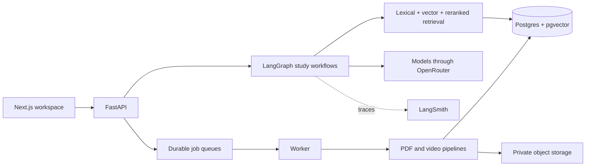

# Agentic Study Partner

An evidence-first study workspace for technical books, papers, and lectures.
It turns source material into cited answers, summaries, revision sheets,
flashcards, and interview practice while keeping every important claim linked
to a page or timestamp.

It is a personal project, not a hosted public service. Its strongest evidence is the inspectable retrieval and evaluation pipeline;
some generative quality sets are still synthetic and are labelled as such.

## What it does

- Ingests digital and scanned PDFs into a canonical hierarchy of sections,
  text, tables, and figures.
- Ingests uploaded or YouTube-hosted lectures, captions/audio, slides, frames,
  OCR, and linked PDFs.
- Answers multi-turn questions with page or timestamp citations.
- Loads complete source scopes for chapter, paper, and lecture summaries rather
  than pretending top-k search is complete.
- Supports source-first reading, anchored side chats, read-aloud, flashcards,
  revision sheets, adaptive interviews, and listen-only ideal interviews.
- Records explicit LangGraph decisions and model calls in LangSmith when
  tracing is configured.
- Keeps canonical source data separate from rebuildable chunks, embeddings,
  captions, summaries, and generated study artifacts.

## System at a glance



The default book search is hybrid retrieval plus hosted reranking. That choice
was earned on a 12-question retrieval set: Recall@5 rose from 88.9% for BM25 to
100%; see [Evaluation](docs/evaluation.md) for the limits of that result.

## Run locally

Prerequisites: Docker, Node.js 24, `npm`, and [`uv`](https://docs.astral.sh/uv/).
An OpenRouter key is required for embeddings and generated features.

```bash
cp .env.example .env
# Add OPENROUTER_API_KEY to .env

scripts/local.sh setup
scripts/local.sh up
scripts/local.sh doctor
```

Open `http://localhost:3000`. The API health endpoint is
`http://localhost:8000/api/health`. Stop the stack without deleting local data:

```bash
scripts/local.sh down
```

`setup` starts local Supabase for Auth and Storage, applies the Postgres
migrations, installs locked Python and frontend dependencies, and writes local
credentials to ignored environment files. The default development command runs
the API and workers together. Railway production does the same in its `api`
service because both processes share one mounted media volume.

## Verify a change

```bash
uv sync --frozen
uv run python -m unittest discover -s tests -v

cd frontend
npm ci
npm run typecheck
npm test
npm run build
```

CI also builds the production image, starts a migrated local Supabase stack,
and parses a real generated PDF inside the container.

## Documentation

| Read this | For |
|---|---|
| [Architecture](docs/architecture.md) | Components, data ownership, and technology choices |
| [RAG and agent flows](docs/flows.md) | Every retrieval or agentic workflow, with diagrams |
| [Evaluation](docs/evaluation.md) | Datasets, metrics, results, improvements, and limitations |
| [Interface](docs/interface.md) | Current screens, interaction rules, and accessibility contract |
| [Development and operations](docs/operations.md) | Setup, configuration, workers, deployment shape, and recovery |
| [Design decisions](docs/design-decisions.md) | The key design choices, their trade-offs, and known limitations |
| [Contributing](CONTRIBUTING.md) | Change process and evidence rules |
| [Security](SECURITY.md) | Security boundaries and reporting guidance |

FastAPI also exposes generated OpenAPI documentation at `/docs` while the API
is running. That is the source of truth for request and response schemas.

## Repository map

| Path | Responsibility |
|---|---|
| `api/` | Authenticated HTTP and streaming boundaries |
| `ingestion/`, `parsing/`, `storage/` | PDF preflight, canonical import, queues, and persistence |
| `retrieval/`, `study/` | Chunking, search, grounding, summaries, and book/paper chat |
| `video/` | Lecture ingestion, multimodal evidence, lecture and course RAG |
| `decks/`, `revision_sheets/` | Derived study artifacts with coverage checks |
| `interviews/`, `narration/` | Adaptive/ideal interviews and voice/read-aloud |
| `evals/`, `evaluation/` | Evaluation code, frozen datasets, and committed result artifacts |
| `frontend/` | Next.js 16 and React 19 interface |
| `supabase/migrations/` | Versioned database schema and owner isolation |
| `tests/` | Backend integration/unit coverage; frontend tests live beside UI code |

## License

No license has been chosen yet, so all rights are reserved: you are welcome to
read the code, but reuse or redistribution needs permission from the author.
