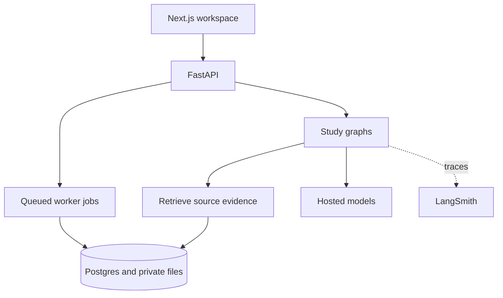

# Agentic Study Partner

An evidence-first workspace for technical books, papers, and lectures. It
produces cited answers, complete-scope explanations, flashcards, revision
sheets, and interview practice. Source material stays separate from generated
study artifacts.

## Features

| Feature | Behavior | Flow |
|---|---|---|
| Books and papers | Parse digital PDFs; transcribe scanned books with outline review | [PDF ingestion](docs/ingestion.md#pdf-ingestion) |
| Lectures and courses | Combine captions/audio, frames, visual analysis, and supporting PDFs | [Video ingestion](docs/ingestion.md#video-ingestion) |
| Questions | Search selected sources; cite pages or timestamps; optionally use external answers | [Questions](docs/flows.md#questions) |
| Reading and side chats | Ask about an open page, chapter, selected passage, or previous answer | [Reading](docs/flows.md#reading-and-side-chats) |
| Chapter explanation | Explain the complete scope with citations and coverage checks | [Summaries](docs/flows.md#complete-summaries) |
| Verbatim reading | Display parsed source text in ordered installments | [Verbatim](docs/flows.md#verbatim-reading) |
| Flashcards and reminders | Create cited cards, schedule reviews, and notify when a daily queue is available | [Flashcards](docs/flows.md#flashcards) |
| Revision sheets | Generate downloadable sheets with figure, citation, and quality checks | [Revision sheets](docs/flows.md#revision-sheets) |
| Interviews | Run adaptive, graded sessions or play generated ideal exchanges | [Interviews](docs/flows.md#interviews) |
| Read-aloud | Speak answers or source passages; optionally interrupt with a voice question | [Audio](docs/flows.md#read-aloud) |

## System



Ingestion uses deterministic Python. LangGraph coordinates study decisions
and bounded repairs. The default book search is hybrid retrieval with
reranking: Recall@5 improved from 88.9% to 100% on 12 answerable evaluation
questions. This is a small, source-specific result; see [evaluation](docs/evaluation.md).

## Documentation

The main reading order is architecture → ingestion → study flows → design
decisions → evaluation. Detailed setup and transport behavior live in the
reference guides.

| Guide | Contents |
|---|---|
| [Architecture](docs/architecture.md) | Stack, storage, retrieval, authentication, reliability |
| [LangGraph workflows](docs/langgraph.md) | Graphs exported from compiled workflows, state, routing, regeneration |
| [Database schema](docs/database.md) | Table inventory, core relationships, ownership, migration reference |
| [Ingestion](docs/ingestion.md) | Digital books, OCR and human review, papers, multimodal video |
| [Study flows](docs/flows.md) | Questions, reading, generated artifacts, interviews, audio |
| [Design decisions](docs/design-decisions.md) | Model defaults, selection rationale, tradeoffs |
| [Evaluation](docs/evaluation.md) | Measurements, datasets, failed experiments, limits |
| [Interface](docs/interface.md) | Rendering and data fetching, screens, interaction rules, accessibility |
| [Interview voice](docs/interview-voice.md) | LiveKit and HTTP speech transport, recovery, privacy |
| [Operations](docs/operations.md) | Setup, configuration, workers, deployment, CI |

[Contributing](CONTRIBUTING.md) covers change policy;
[Security](SECURITY.md) covers security boundaries. The running API exposes
request/response schemas at `/docs`.

## Run locally

Prerequisites: Docker, Node.js 24, `npm`, `uv`, and an OpenRouter API key.

```bash
cp .env.example .env
# Set OPENROUTER_API_KEY in .env
scripts/local.sh setup
scripts/local.sh up
scripts/local.sh doctor
```

Web: `http://localhost:3000`; API health: `http://localhost:8000/api/health`.
`scripts/local.sh down` stops services without deleting data.

## Verify changes

```bash
uv sync --frozen
uv run python -m unittest discover -s tests -v
cd frontend
npm ci
npm run typecheck
npm test
npm run build
```

## Code map

| Path | Responsibility |
|---|---|
| `api/` | Authentication, HTTP contracts, streaming |
| `ingestion/`, `parsing/`, `storage/` | PDF parsing, canonical storage, durable jobs |
| `retrieval/`, `study/` | Search, grounding, book/paper conversations |
| `video/` | Lecture/course ingestion and multimodal study |
| `decks/`, `notifications/`, `revision_sheets/` | Cards, reviews, reminders, sheets |
| `interviews/`, `narration/` | Interview reasoning, speech, read-aloud |
| `evals/`, `evaluation/` | Evaluation code, datasets, result artifacts |
| `frontend/` | Next.js/React interface |
| `supabase/migrations/`, `tests/` | Schema, ownership constraints, automated checks |

## License

No license has been selected. All rights reserved; reuse or redistribution
requires permission.
