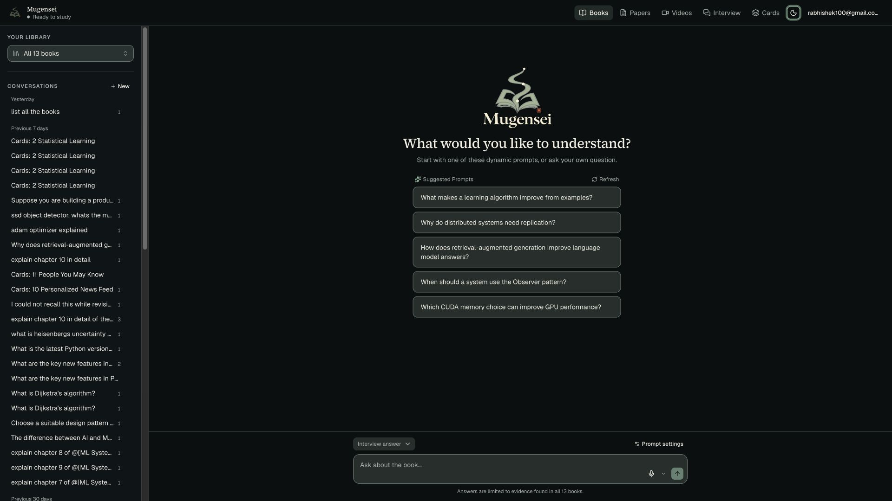
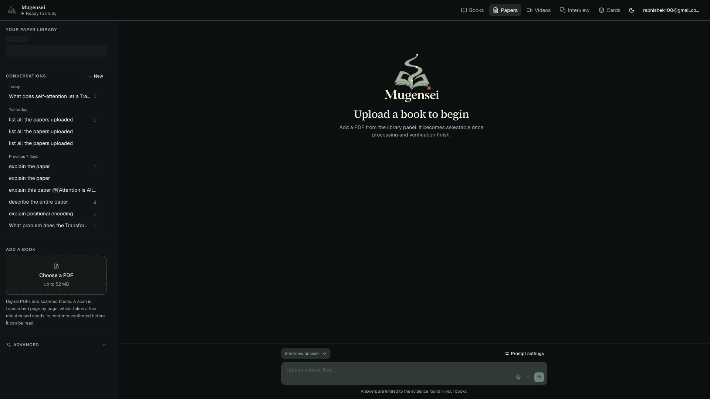
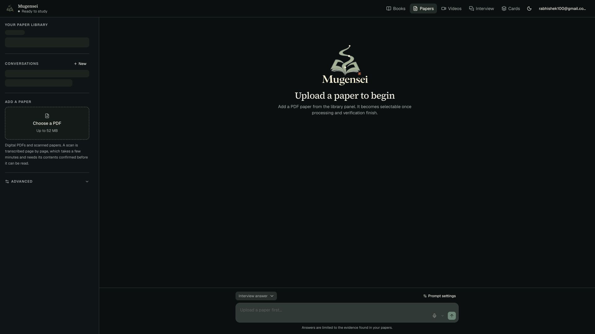
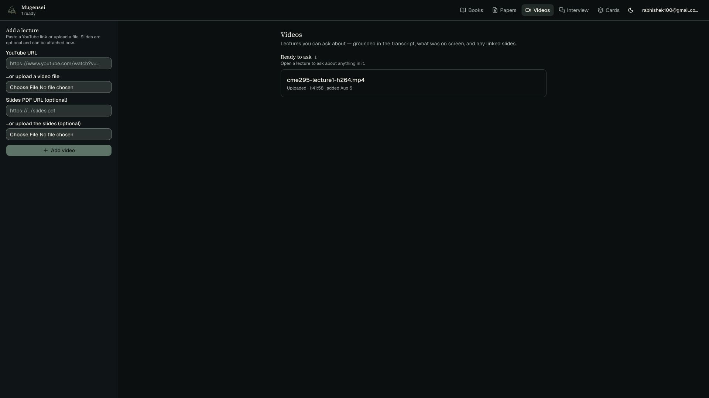
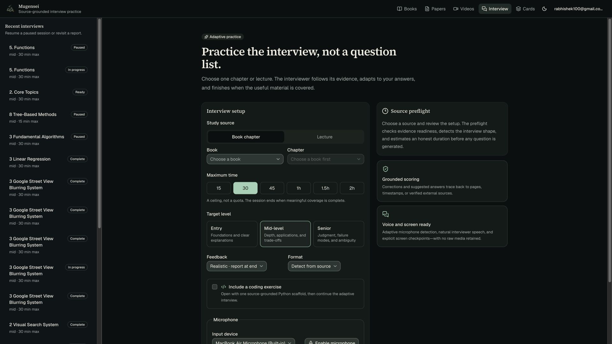
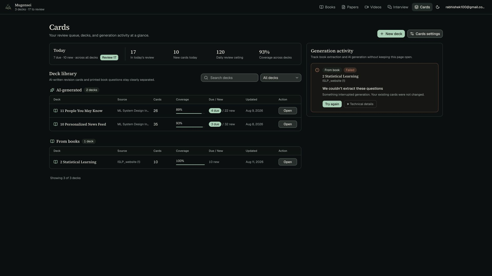

# Mugensei production experience audit

Audited August 15, 2026 against the signed-in Railway production app at
`https://web-production-8529e.up.railway.app/`. The review covered the five
primary product areas at a 1920 × 1080 desktop viewport in the dark theme.

## Overall verdict

The new Mugensei shell, palette, and wordmark are working in production.
Books, Interview, and Cards already form a credible calm-futuristic product.
Papers and Videos lag behind: Papers exposes book-specific language throughout,
while Videos uses generic upload controls and leaves most of the canvas without
useful structure.

## Flow steps

### 1. Books — healthy, with density concerns

- The Mugensei hero, suggested prompts, and persistent composer establish a
  clear study entry point.
- The conversation sidebar is too dense for a mature library. Repeated titles
  and a long unfiltered history make recent work harder to recover.
- The header and sidebar metadata are small and subdued. Contrast should be
  measured for these exact rendered text sizes, not inferred from token values.

### 2. Papers — corrected during this audit

- The selected route and sidebar say Papers, but the main experience says
  “Upload a book,” “Add a book,” “Ask about the book,” and “evidence found in
  your books.” This breaks orientation and trust.
- The loading placeholders in the paper library have no explanatory status,
  while the empty main state implies there are no sources despite existing
  paper conversations.
- The next pass should make the shared conversation shell source-aware rather
  than duplicating the Books wording.

#### Production resolution

The follow-up release made the shared selector, upload panel, empty state,
question composer, accessible textarea label, scope summary, and evidence
promise paper-aware. The final production DOM and screenshot contain the
expected paper language throughout; the original screenshot above is retained
as the evidence that prompted the fix.

### 3. Videos — functional but visually unfinished

- The route has a clear purpose and the ready lecture is discoverable.
- Native file inputs, the full-height upload rail, and a single plain lecture
  row feel disconnected from the Mugensei system.
- The layout leaves a large unused field. A compact add-lecture panel plus a
  richer lecture card could surface duration, readiness, transcript/slides
  coverage, and the primary “Open lecture” action.

### 4. Interview — strong, with navigation friction

- This is the strongest expression of the intended brand: editorial hierarchy,
  restrained green emphasis, and evidence-first reassurance.
- The setup form explains trade-offs well and exposes explicit source, time,
  level, feedback, format, coding, and microphone choices.
- The recent-interviews rail is very long and visually repetitive. Status
  filters, search, or grouping would improve resume/revisit tasks.
- At this viewport, the primary review action falls below the fold. That is not
  necessarily wrong, but keyboard order and sticky-action behavior should be
  tested before changing it.

### 5. Cards — healthy and production-ready

- Review urgency, deck inventory, provenance, coverage, and generation status
  are visible without opening a deck.
- The failure panel uses reassuring copy and preserves an obvious recovery
  action without implying existing cards were lost.
- Small secondary labels and table density need responsive and zoom testing;
  the screenshot alone cannot confirm reflow or keyboard operation.

## Highest-impact implementation order

1. ~~Replace book-specific copy and empty-state behavior on Papers with a
   source-aware shared conversation shell.~~ Completed in production during
   this audit.
2. Bring Videos into the Mugensei component system with branded upload controls,
   richer lecture metadata, and a more intentional desktop composition.
3. Add search, grouping, or filters to the Books conversation history and the
   Interview session history.
4. Standardize section-level headings, loading states, error states, and small
   metadata typography across all five routes.
5. Run responsive, keyboard, focus, zoom, and screen-reader checks. Screenshots
   confirm visual state only and do not establish WCAG conformance.

## Accessibility evidence and limits

The captured DOM includes a skip link, semantic headings, named navigation,
labeled inputs, button states, progress bars, and status-oriented copy. Those
are strong foundations. The audit did not verify keyboard traversal, focus
visibility, screen-reader announcements, reduced motion, 200% zoom, or mobile
reflow. Muted small text and dense scroll regions remain risks until those
checks are run directly.
