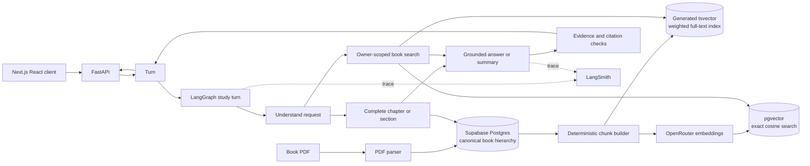

# Architecture

The system keeps lossless extracted book content separate from anything that
can be rebuilt. One owner-scoped Postgres database holds both classes of data,
while table boundaries and foreign keys preserve that distinction.

## Data boundaries

- Canonical: `books`, `nodes`, `content_blocks`, `table_blocks`, and
  `image_blocks`. A restore must reproduce the parsed model without loss.
- Derived: `chunk_builds`, `chunks`, `chunk_sources`, the generated
  `search_vector`, and `chunk_embeddings`. They can be deleted and rebuilt
  from canonical rows.
- Source PDFs belong in the private Supabase Storage `book-sources` bucket.
  Database rows retain local provenance plus the optional bucket/object path.
- Complete chapter and section summaries load the full selected section tree;
  they do not depend on a small search result set.
- Ordinary questions search chunks, attach exact source pages, and return
  insufficient evidence when the book does not support an answer.
- Next.js proxies requests to the FastAPI conversation workflow and contains no
  separate answering logic.

## Ownership boundary

Every application table has `owner_id`. Composite foreign keys prevent a row
from referring to another owner's parent, and every application query includes
the bootstrap owner filter. RLS policies additionally require
`owner_id = auth.uid()` for authenticated Supabase clients.

Until frontend Auth is implemented, FastAPI uses the server-controlled
`DEFAULT_OWNER_ID`; it does not derive identity from a browser-supplied value.
That mode is suitable for local/single-user operation only. JWT propagation,
frontend Auth, and cross-user isolation tests are a separate deferred stage.

## Retrieval choices

- Lexical search uses a weighted generated `tsvector`: title weight A,
  hierarchy path B, body D. A GIN index supports the match predicate.
- Semantic search stores `vector(3072)` with model, revision, input-format,
  dimension, and content-hash provenance.
- Exact cosine search is deliberate at the current corpus size. Approximate
  indexing requires a measured latency need and a dimension-compatible design.
- Hybrid retrieval uses reciprocal-rank fusion; the optional OpenRouter-hosted
  reranker only operates on a bounded hybrid shortlist.
