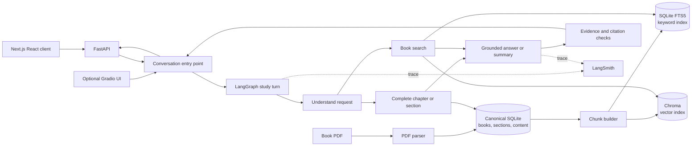

# Architecture

The system keeps extracted book content separate from anything that can be rebuilt. The study workflow chooses between loading a complete chapter or searching small chunks, then returns an answer only with evidence from the book.

## Important boundaries

- `data/books.sqlite3` is the lossless book record after ingestion. It contains the book structure and ordered content, not summaries or search indexes.
- `data/retrieval.sqlite3` and `data/chroma/` are generated search data. They can be deleted and rebuilt from the canonical database.
- Complete chapter and section summaries load the whole selected section tree. They do not rely on a small set of search results.
- Ordinary questions search chunks, attach their exact source pages, and return “insufficient evidence” when the book does not support an answer.
- The Next.js and Gradio interfaces call the same conversation workflow. They do not contain separate answering logic.
