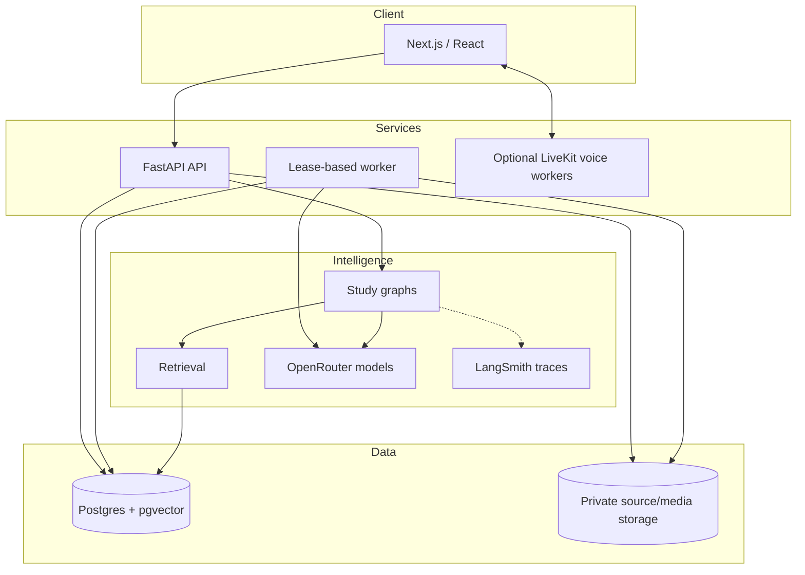
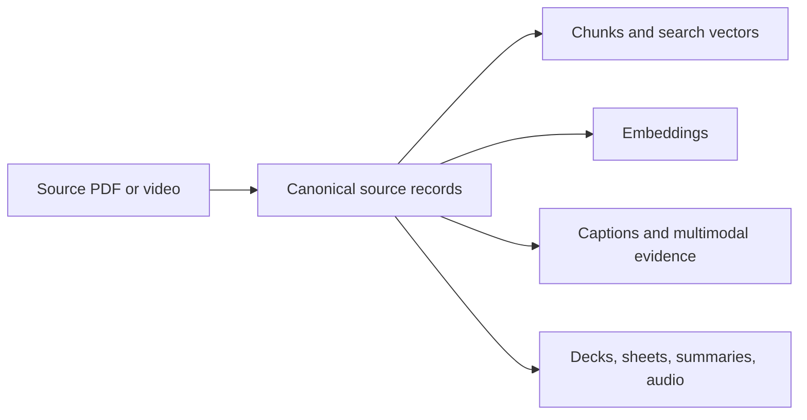

# Architecture

## Product boundary

The application helps one authenticated user study sources they control. The
browser presents evidence and generated artifacts; it does not generate claims
or own business rules. FastAPI validates identity and requests, workers perform
long jobs, Postgres stores durable state, and object storage holds source/media
bytes.

## Components

### Runtime responsibilities

| Component | Owns | Does not own |
|---|---|---|
| Next.js | Navigation, source viewers, playback, accessible interactions | Retrieval or answer generation |
| FastAPI | Auth, validation, streaming, signed media access, API contracts | Long ingestion work |
| Worker | Durable book/video/deck/revision jobs, retries, cleanup | User-facing HTTP |
| Postgres | Canonical content, job state, conversations, derived indexes, owner isolation | Original large media bytes |
| Object storage | Source PDFs, video media, extracted figures, generated audio/PDFs | Search and workflow state |
| LangGraph | Explicit routing, bounded retries, state transitions | Unrestricted autonomous action |
| LangSmith | Traces for graphs and model calls when enabled | Product state or evaluation truth |

## Canonical and derived data

For PDFs, `books`, hierarchy nodes, content blocks, tables, and image records
are canonical. For video, source/version records, chapters, transcript cues,
resources, and source-aligned media metadata are canonical. Search chunks,
vectors, captions, evidence indexes, generated artifacts, and caches are
derived. Derived data is versioned by input/configuration hashes and can be
rebuilt; canonical data is never hand-edited to repair a search result.

## Retrieval design

Book and paper retrieval uses the same citation-aware chunks with four
selectable strategies:

1. weighted Postgres-normalized BM25;
2. exact cosine search over 3,072-dimensional hosted embeddings;
3. reciprocal-rank fusion (RRF) of lexical and vector results;
4. a hosted cross-encoder over 20 fused candidates.

The product default is `hybrid_rerank`. If the reranker is unavailable, the
system logs the failure and returns the already grounded hybrid ordering.
Approximate vector indexes are deliberately absent: the current corpus has not
demonstrated a latency need for them.

Lecture retrieval fuses transcript, OCR, visual observations, and linked-PDF
pages on one timeline. Course retrieval searches multiple published lectures
with per-lecture limits so one lecture cannot crowd out the rest.

Complete summaries do not use top-k retrieval. They load the full canonical
chapter, paper, or transcript scope and fail rather than silently truncate a
scope that exceeds its configured context budget.

## Tenancy and security

- The API derives `owner_id` from a verified Supabase access token.
- Database rows and storage keys are owner-scoped; row-level security is also
  defined in migrations.
- Source, media, generated audio, and revision files are private and served
  through authenticated or signed paths.
- Upload type/size is checked before processing; stored bytes are rechecked by
  workers.
- Model-generated SQL is never executed.
- Raw interview audio and screen checkpoints are processed ephemerally and are
  not persisted.

`DEFAULT_OWNER_ID` exists for local scripts and evaluations only. HTTP handlers
must not use it as an identity fallback.

## Reliability shape

Book, video, deck, and revision jobs are durable. Workers claim jobs with
leases, renew ownership while running, commit stage boundaries, and reclaim
expired attempts. Ingestion is idempotent: source hashes, build hashes, stage
dependency hashes, and idempotency keys prevent duplicate or drifting output.
Cleanup jobs use grace periods and orphan-fraction guards to avoid deleting
data against a partial or restored database.

## Why these choices

| Choice | Reason |
|---|---|
| Postgres for canonical and retrieval data | One transactional source of truth; FTS and pgvector are sufficient here |
| Deterministic pipeline code | Parsing and persistence need repeatability, not agent judgment |
| LangGraph only for decision loops | Routes, retries, and termination remain inspectable |
| Full-scope summaries | Retrieval recall cannot prove chapter completeness |
| Hosted embeddings/reranking | Keeps the local runtime small; provenance is stored |
| One worker process with several queues | Production-shaped without distributed infrastructure for imaginary scale |
| Next.js as a thin client | Grounding and policy stay server-side and testable |

## Main technology

Python 3.12, FastAPI, LangChain, LangGraph, LangSmith, Psycopg, Postgres,
pgvector, PyMuPDF, Unstructured, OpenRouter, Supabase Auth/Storage, Cloudflare
R2-compatible storage, Next.js 16, React 19, TypeScript, LiveKit, Vitest, and
Python `unittest`/pytest-compatible tests.
