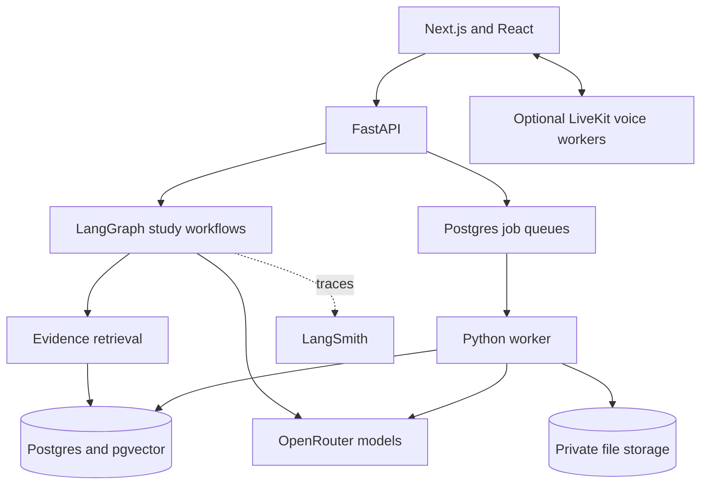
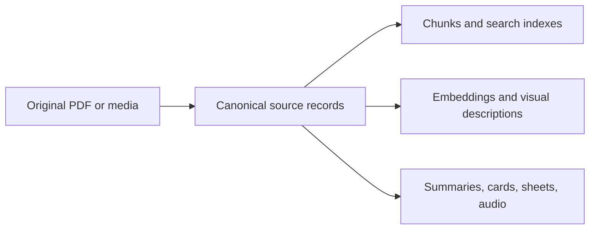
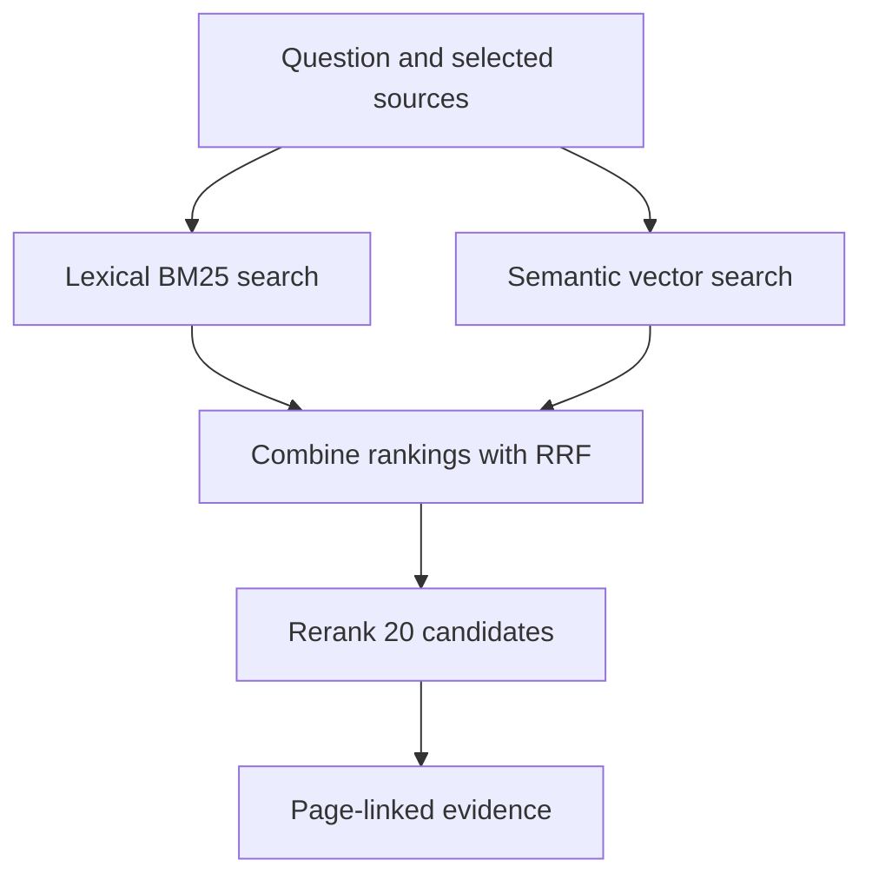
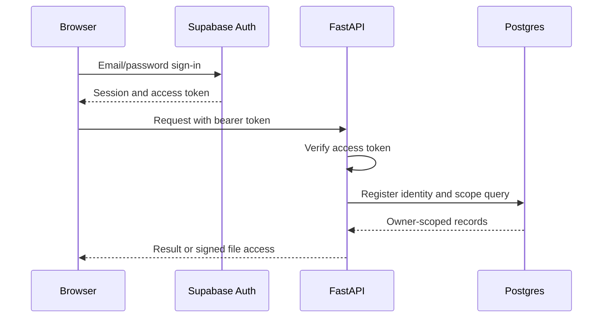

# Architecture

The browser presents sources and study results. FastAPI enforces identity and
contracts; workers handle long jobs; study graphs make explicit decisions.
Postgres owns durable state, and private object storage owns large files.

## Components and stack

| Layer | Technology | Responsibility |
|---|---|---|
| Interface | Next.js 16, React 19, TypeScript | Source viewers, controls, playback; no answer generation |
| API | Python 3.12+, FastAPI, Pydantic | Auth, validation, streaming, signed file access |
| Workflow | LangGraph, LangChain | Explicit state/routing; model, prompt, retriever, structured-output integration |
| Parsing | PyMuPDF, Unstructured; vision OCR | PDF preflight, layout, transcription, hierarchy |
| Video | yt-dlp, FFmpeg, OpenCV, Tesseract | Acquisition, audio, frames, frame text |
| Data | Postgres, Psycopg, pgvector | Source hierarchy, search, jobs, conversations, study artifacts |
| Files and identity | Supabase Auth; Supabase Storage, filesystem, or S3-compatible R2 | Verified identity and private source/media bytes |
| Models and traces | OpenRouter, LangSmith | Hosted inference; graph/model traces when configured |
| Optional voice | LiveKit Inference and workers | Streaming speech recognition and playback |
| Verification | Python unittest, Vitest, Docker, GitHub Actions | Contracts, frontend behavior, integration and image checks |

## Source and derived data

PDF canonical records include books/papers, hierarchy nodes, page text,
tables, and image records. Video records include source versions, transcript
cues, chapters, resources, and timestamped media metadata. Derived artifacts
carry input/configuration provenance and can be rebuilt. Search corrections
must not hand-edit canonical content.

## Retrieval

Book/paper search supports `bm25`, `vector`, `hybrid`, and the product default
`hybrid_rerank`. BM25 ranks keyword matches; vectors rank semantic similarity.
Reciprocal rank fusion (RRF) combines ranks rather than incompatible raw scores.
Vector search uses exact cosine distance over 3,072-dimensional embeddings;
no approximate index is required at the current corpus size. Reranker failure
returns the hybrid ordering and records the failure.

Lecture search combines transcript, frame OCR, visual observations, and
supporting-PDF pages. Course search limits results per lecture. Complete
summaries load the entire selected canonical scope instead of top-k matches.

Code: [retrieval](../retrieval/search.py), [lecture retrieval](../video/retrieval.py),
[course retrieval](../video/course_retrieval.py).

## Authentication and ownership

The browser SDK persists and refreshes the session. Sign-up may require email
confirmation; demo login, when configured, uses the same auth path. Only the
verified token subject determines `owner_id`. Asymmetric public signing keys
come from cached JWKS; local/legacy HS256 tokens require a configured secret. Invalid tokens
receive 401.

API/store queries and object keys enforce ownership. Database RLS definitions
are additional controls where enabled, not a substitute for API checks.
Source/media files are private. Provider, database, and service-role secrets
remain server-side. `DEFAULT_OWNER_ID` is restricted to scripts/evaluations.

Code: [browser auth](../frontend/lib/supabase.ts), [token verification](../api/auth.py),
[identity registry](../storage/application_users.py). See [security](../SECURITY.md).

## Reliability and observability

- Book, video, card, and sheet jobs use durable queues, leases, heartbeats,
  checkpoints, and expired-attempt recovery.
- Source hashes, build/dependency hashes, and idempotency keys prevent duplicate
  work and unsafe reuse. Partial ingestion is not published.
- Network/model calls stay outside long database transactions. Cleanup has
  grace periods and orphan-fraction guards.
- LangSmith records graph/model decisions when enabled; structured logs and
  saved job/session state support recovery. Voice-provider usage is separate.
- Models never execute unrestricted SQL or shell commands.

Selection rationale and model defaults: [design decisions](design-decisions.md).
Process layout and deployment: [operations](operations.md).
