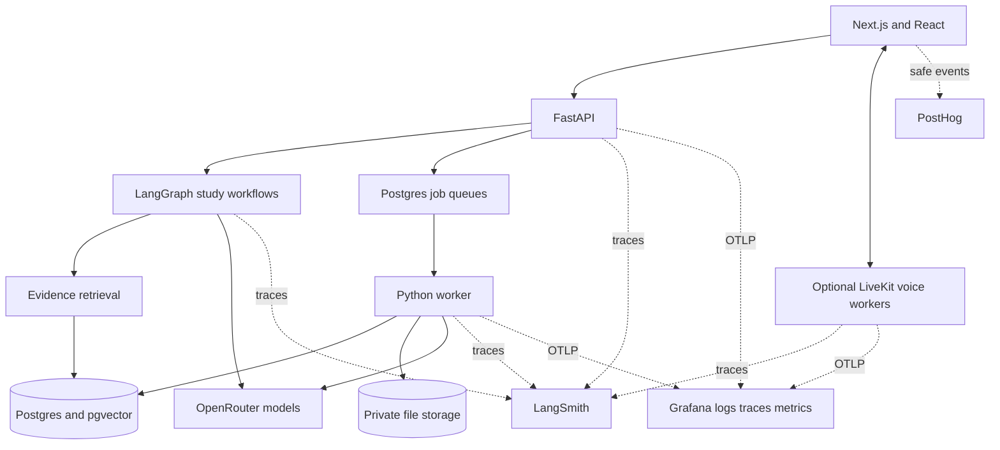
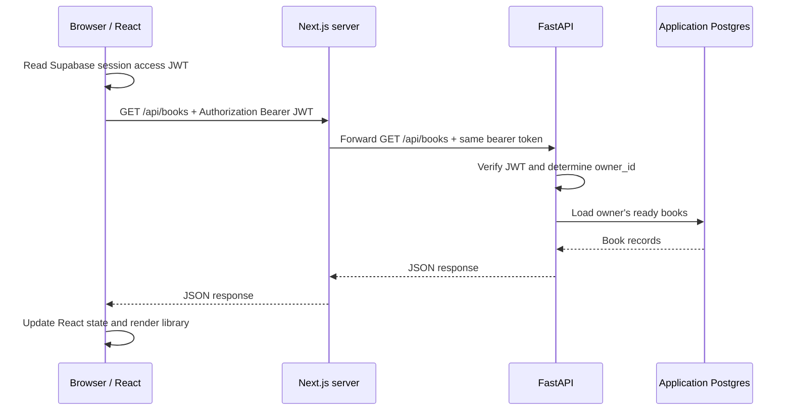
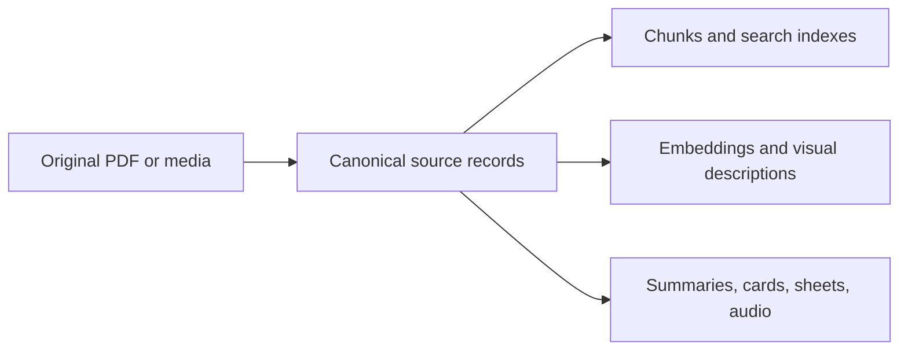
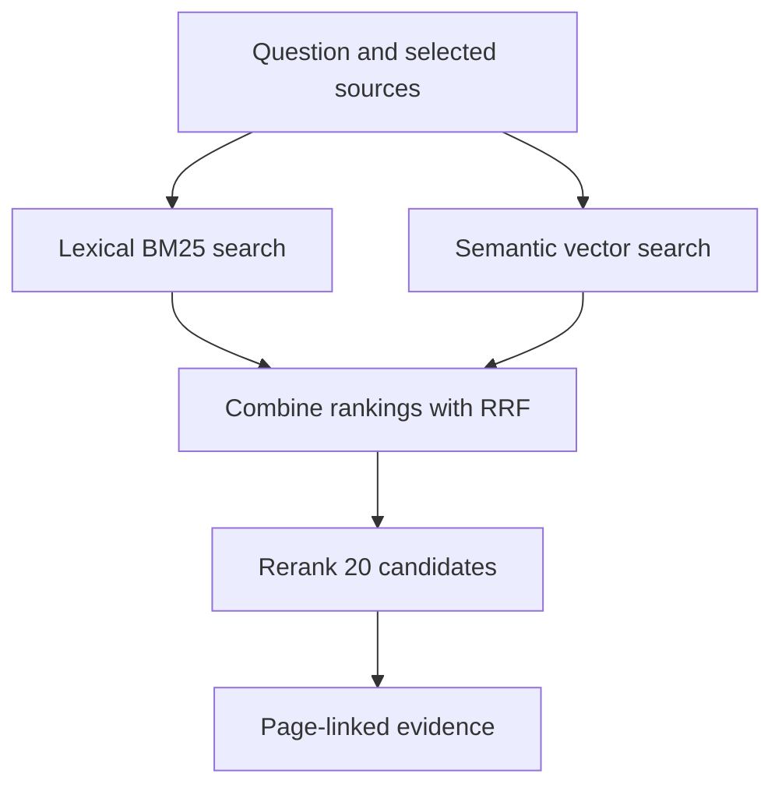
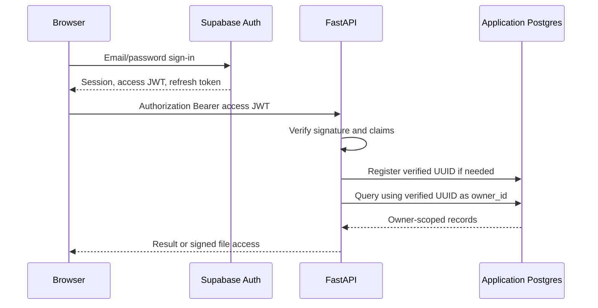

# Architecture

The browser presents sources and study results. FastAPI enforces identity and
contracts; workers handle long jobs; study graphs make explicit decisions.
Postgres owns durable state, and private object storage owns large files.

## Components and stack



| Layer | Technology | Responsibility |
|---|---|---|
| Interface | Next.js 16, React 19, TypeScript | Source viewers, controls, playback; no answer generation |
| API | Python 3.12+, FastAPI, Pydantic | Auth, validation, streaming, signed file access |
| Workflow | LangGraph, LangChain | Explicit state/routing; model, prompt, retriever, structured-output integration |
| Parsing | PyMuPDF, Unstructured; vision OCR | PDF preflight, layout, transcription, hierarchy |
| Video | yt-dlp, FFmpeg, OpenCV, Tesseract | Acquisition, audio, frames, frame text |
| Data | Postgres, Psycopg, pgvector | Source hierarchy, search, jobs, conversations, study artifacts |
| Files and identity | Supabase Auth; Supabase Storage, filesystem, or S3-compatible R2 | Verified identity and private source/media bytes |
| Models and traces | OpenRouter, LangSmith | Hosted inference with optional provider pinning; HTTP, workflow, graph, retrieval and provider traces |
| Operational observability | OpenTelemetry, Grafana Cloud | Structured Loki logs, Tempo boundaries, operation/process metrics |
| Product analytics | PostHog Cloud | Safe UI/API events and opaque authenticated identity; replay disabled |
| Optional voice | LiveKit Inference and workers | Streaming speech recognition and playback |
| Verification | Pytest including unittest cases, Vitest, Docker, GitHub Actions | Contracts, frontend behavior, integration and image checks |
| Quality evaluation | In-repo harness (`evals/`), LangSmith experiment projects | Calls native feature code on frozen sources under a per-experiment budget; source-backed LLM review |

The evaluation harness is a separate client of the same feature code, not a
second implementation: adapters call the production chat, summary, video/course,
sheet and interview functions without persisting user artifacts, and an
evaluation-only HTTP guard enforces the budget. It never runs inside the
serving API. See [evaluation harness](evaluation.md#evaluation-harness).

The Next.js interface prerenders its initial UI, then hydrates Client Components
and loads authenticated study data in the browser. See
[rendering and data fetching](interface.md#rendering-and-data-fetching) for the
component boundaries and request path.

## Browser-to-API request path

Next.js has two roles here: it serves the React interface and forwards ordinary
API traffic to the separate FastAPI service. Once hydrated, the React page's
request code runs in the browser. The Next.js server receives that HTTP request
and applies an external rewrite configured in
[next.config.mjs](../frontend/next.config.mjs). A rewrite proxies the request
while keeping its frontend URL, as described in the
[Next.js rewrite reference](https://nextjs.org/docs/app/api-reference/config/next-config-js/rewrites).
The proxy timeout is raised to ten minutes because complete ideal-interview
generation is a long synchronous request; Next's 30-second default
disconnected the browser while the API kept generating.

For example, the library page calls `apiFetch("/books")`:



1. [apiFetch](../frontend/lib/api.ts) adds `/api` to the supplied path, reads
   the Supabase access token, and attaches `Authorization: Bearer <JWT>`.
   A relative URL uses the current page's origin: for a page at
   `http://localhost:3000`, the request goes to
   `http://localhost:3000/api/books`.
2. Next.js matches `/api/:path*` and forwards it to
   `${BACKEND_URL}/api/:path*`. With the default
   `BACKEND_URL=http://127.0.0.1:8000`, the upstream URL is
   `http://127.0.0.1:8000/api/books`. In Docker Compose it is
   `http://api:8000/api/books`; the Next.js container can resolve the `api`
   service name. The request method, query, body, and bearer header travel
   through this proxy.
3. [FastAPI's books endpoint](../api/main.py) uses `Depends(current_owner)`
   to verify identity and queries Postgres with the verified owner UUID.
   Other endpoints validate their request contracts and perform the relevant
   study operation or create a durable worker job.
4. The response returns through Next.js. `apiFetch` parses successful JSON
   (or handles an empty 204), and raises `ApiError` for a failed HTTP status.
   The React caller updates its state to render the result or error.

There are no `frontend/app/api/.../route.ts` handlers implementing these API
endpoints. The `/api` prefix is a routing convention shared by the frontend
helper, Next.js rewrite, and FastAPI routes. Next.js forwards transport;
FastAPI owns authentication, authorization, and study operations. Because the
browser calls its own frontend origin, ordinary proxied requests do not need
a cross-origin browser hop to the backend. This routing does not authenticate
the user: FastAPI still verifies the bearer token.

### Streaming and direct requests

Chat follows the same proxy route, but
[useChat](../frontend/hooks/use-chat.ts) calls `fetch("/api/chat/stream")`
and reads a streamed response instead of using the JSON helper. FastAPI emits
Server-Sent Events; the browser consumes events and updates the answer as they
arrive. The Next.js configuration sets `compress: false` to avoid compression
buffering this stream.

Binary requests using `uploadUrl` take a different path when
`NEXT_PUBLIC_API_ORIGIN` is configured:

```text
Browser → NEXT_PUBLIC_API_ORIGIN/api/... → FastAPI → Browser
```

This includes video/media uploads and audio transcription requests. It avoids
the Next.js proxy's request-body buffering for large payloads. The browser
still sends the bearer JWT, and FastAPI's `CORS_ALLOWED_ORIGINS` must allow the
frontend origin. Without `NEXT_PUBLIC_API_ORIGIN`, `uploadUrl` falls back to
the same-origin `/api` proxy. Supabase sign-in/session refresh goes directly
from the browser SDK to Supabase Auth; signed storage URLs can also take the
browser directly to the file storage service.

| Setting | Used by | Purpose |
|---|---|---|
| `BACKEND_URL` | Next.js server/configuration | FastAPI origin for `/api` rewrites; omit the `/api` suffix |
| `NEXT_PUBLIC_API_ORIGIN` | Browser bundle | Browser-reachable FastAPI origin for direct binary requests; omit `/api` |
| `CORS_ALLOWED_ORIGINS` | FastAPI | Allowed frontend origins for direct browser requests |

Request sources: [library page](../frontend/app/page.tsx),
[API/token helpers](../frontend/lib/api.ts),
[browser session](../frontend/lib/supabase.ts),
[API auth](../api/auth.py), [Docker routing](../docker-compose.yml).
Token verification details: [authentication and ownership](#authentication-and-ownership).

## Source and derived data



PDF canonical records include books/papers, hierarchy nodes, page text,
tables, and image records. Video records include source versions, transcript
cues, chapters, resources, and timestamped media metadata. Derived artifacts
carry input/configuration provenance and can be rebuilt. Search corrections
must not hand-edit canonical content.

Tables, relationships, and migration definitions: [database schema](database.md).

## Retrieval



Book/paper search supports `bm25`, `vector`, `hybrid`, and the product default
`hybrid_rerank`. BM25 ranks keyword matches; vectors rank semantic similarity.
Reciprocal rank fusion (RRF) combines ranks rather than incompatible raw scores.
Vector search uses exact cosine distance over 3,072-dimensional embeddings;
no approximate index is required at the current corpus size. Reranker failure
returns the hybrid ordering and records the failure.

Lecture search combines transcript, frame OCR, visual observations, and
supporting-PDF pages. Course search limits results per lecture. Complete
summaries load the entire selected canonical scope instead of top-k matches.
After ranking, book QA completes the strongest section with its nearest chunks
from the same node and source build, bounded so other ranked sections keep at
least two slots. Course answers receive each selected passage in full.

Code: [retrieval](../retrieval/search.py), [section expansion](../study/query.py), [lecture retrieval](../video/retrieval.py),
[course retrieval](../video/course_retrieval.py).

## Authentication and ownership



Supabase Auth is the identity provider; Railway Postgres is the deployed
application database. They are separate systems connected through the identity
in a verified token. Supabase does not need to connect to Railway Postgres to
authenticate a user, and the browser does not connect to Railway Postgres.

### Login, session, and tokens

[AuthGate](../frontend/components/auth-gate.tsx) calls
`supabase.auth.signInWithPassword` with email/password. Supabase checks the
credentials and returns a session containing a user, an **access token**, and
a **refresh token**. Sign-up calls `signUp`; a project requiring email
confirmation may return a user without a session until confirmation and login.
The optional demo account uses the same password-login path.

The access token is a signed JWT, with the form
`header.payload.signature`. Its payload is readable encoded JSON, not encrypted
application data. Claims identify the issuer (`iss`), user UUID (`sub`), intended
audience (`aud`), issued time (`iat`), expiry (`exp`), and role. Changing the
payload invalidates the signature. A refresh token is a separate opaque string
that the SDK exchanges with Supabase Auth for a new access/refresh token pair;
it is not sent to the study API. See Supabase's
[JWT reference](https://supabase.com/docs/guides/auth/jwts) and
[session reference](https://supabase.com/docs/guides/auth/sessions).

[frontend/lib/supabase.ts](../frontend/lib/supabase.ts) enables `persistSession`
and `autoRefreshToken`. With no custom storage adapter, the browser SDK uses
localStorage when available (memory otherwise). This implementation uses
browser-managed sessions, not server-managed HTTP-only session cookies.
[useSession](../frontend/hooks/use-session.ts) restores the session and listens
for auth changes. [apiFetch](../frontend/lib/api.ts) reads `session.access_token`
and sends it as:

```http
Authorization: Bearer <access-token>
```

The bearer token authenticates the API request. The browser's Supabase anon
key identifies the Supabase project/client; it is not the signed-in user's
access token and cannot pass this API's authenticated-role check.

### How FastAPI establishes identity

[api/auth.py](../api/auth.py) handles the request through
`authenticated_identity` and `current_owner`:

1. Extract the bearer token and reject missing/malformed credentials.
2. Verify its signature with PyJWT. For supported asymmetric algorithms
   (`ES256`, `RS256`, `EdDSA`), fetch public signing keys from the configured
   issuer's `/.well-known/jwks.json` and select by `kid`. The API caches keys
   for 600 seconds and rate-limits unknown-key refreshes. For local/legacy
   `HS256`, use the server-only `AUTH_JWT_SECRET` instead.
3. Require `exp`, `iat`, `sub`, `aud`, and `iss`; validate time claims, issuer,
   and audience with 10 seconds of clock-skew allowance. Require
   `role = authenticated` and a UUID subject.
4. Set `owner_id` from the verified `sub`, register that identity in the
   application database if needed, and pass the UUID into the endpoint.

Invalid tokens receive 401. The email claim can update the identity registry,
but the UUID determines ownership. Public keys verify signatures; the API does
not need Supabase's private signing key. Verification normally uses cached
keys rather than a Supabase login/session lookup on every request. Public-key
discovery is described in Supabase's
[signing-key reference](https://supabase.com/docs/guides/auth/signing-keys).

### Supabase identity in Railway Postgres

Supabase owns the real login account and session. Railway has a separate,
minimal `auth.users` table created by
[ops/postgres/bootstrap.sql](../ops/postgres/bootstrap.sql), with `id`, `email`,
metadata, and creation time. This compatibility table satisfies the existing
`owner_id` foreign keys; it does not store password hashes or refresh tokens
and does not authenticate anyone.

After verification, [storage/application_users.py](../storage/application_users.py)
upserts `(id, email)` using the JWT's UUID and email. The same UUID therefore
appears as Supabase's user ID, Railway's identity ID, and `books.owner_id`.
Registration is idempotent and cached per process. An email already belonging
to another UUID is refused with 409 rather than reassigned.

FastAPI connects to Railway using the server's `DATABASE_URL` and the pooled
Psycopg connections in [storage/database.py](../storage/database.py). This is a
database service credential, separate from the user's JWT. For example,
`GET /api/books` takes `Depends(current_owner)` and
[list_books](../storage/postgres.py) filters `WHERE owner_id = %s` with that
verified UUID. A request-supplied UUID never determines ownership.

### Authorization and deployment settings

In Railway's configured deployment, the API/worker use the `app_runtime`
database role. They do not set per-user JWT claims on database connections.
Consequently `auth.uid()` would be null: the migration-defined Supabase RLS
policies would match no rows. Deployment SQL
[harden_runtime_role.sql](../ops/postgres/harden_runtime_role.sql) removes those
policies and disables RLS on application tables; subsequent migrations use
[disable_inert_rls.sql](../ops/postgres/disable_inert_rls.sql) to maintain that
posture. User isolation there relies on verified identity and owner-scoped
application SQL, with composite foreign keys keeping related owners aligned.
Local Supabase retains RLS policies for paths using authenticated database
roles and JWT claims. RLS is not a replacement for API ownership checks.

| Setting | Used by | Meaning |
|---|---|---|
| `NEXT_PUBLIC_SUPABASE_URL` | Browser | Supabase Auth project URL |
| `NEXT_PUBLIC_SUPABASE_ANON_KEY` | Browser | Public client credential |
| `AUTH_SUPABASE_URL` | FastAPI | Trusted Supabase Auth project |
| `AUTH_JWT_ISSUER` | FastAPI | Defaults to `<AUTH_SUPABASE_URL>/auth/v1` |
| `AUTH_JWT_AUDIENCE` | FastAPI | Defaults to `authenticated` |
| `AUTH_JWT_SECRET` | FastAPI | Required only for shared-secret HS256 verification |
| `DATABASE_URL` | API/worker | Application Postgres connection credential |

Frontend and backend must refer to the same intended Auth issuer; the database
URL independently points to Railway (or local Postgres). A Supabase service-role
key is not the user's token or the Railway connection credential. Source/media
files remain private and owner-scoped; provider, database, and service-role
secrets stay server-side. `DEFAULT_OWNER_ID` is restricted to scripts/evaluations.

Sign-out uses `supabase.auth.signOut`. The API does not check Supabase's live
`auth.sessions` on each request, so an already-issued JWT can remain acceptable
until expiry while its signature/key remains trusted; clearing the browser's
session is distinct from instantly invalidating every copy of that JWT.

Verification coverage: [token tests](../tests/test_auth.py),
[identity registry tests](../tests/test_application_users.py),
[user isolation tests](../tests/test_multi_user_isolation.py).
See [security](../SECURITY.md) and [database schema](database.md).

## Reliability and observability

### Postgres job queues

The queues are ordinary Postgres tables plus Python code that enqueues,
claims, processes, and recovers jobs. They live in the same database as source
content and study artifacts; the queue box in the diagram describes a role,
not a separate database service. Postgres stores the work; the Python worker
executes it.

| Queue table | Work | Queue implementation |
|---|---|---|
| `public.ingestion_jobs` | Book/paper PDF ingestion | [ingestion/jobs.py](../ingestion/jobs.py) |
| `video.ingestion_jobs` | Lecture ingestion | [video/jobs.py](../video/jobs.py) |
| `public.deck_jobs` | Flashcard generation | [decks/jobs.py](../decks/jobs.py) |
| `public.revision_sheet_jobs` | Revision-sheet generation | [revision_sheets/store.py](../revision_sheets/store.py) |

For example, completing a PDF upload queues its job and returns a job ID to
the browser. The worker polls for eligible rows, claims one in a short
transaction using `FOR UPDATE SKIP LOCKED`, and records its worker identity
and lease expiry. The lock prevents concurrent claimers from taking the same
row; `SKIP LOCKED` lets another worker select other available work. The claim
commits before expensive parsing or model calls, so a database row lock is
not held for the duration of the job.

A lease is a time-limited claim. Heartbeats renew it while processing runs.
The worker saves stages/progress and eventually completion or failure; the API
reads that durable state for the UI. If a worker crashes, the job remains in
Postgres and its lease expires. Eligible PDF, video, and card jobs can be
requeued under their recovery/attempt rules; interrupted revision-sheet jobs
are marked failed for an explicit user retry. Recovery can repeat work, so
idempotency and reusable checkpoints matter; this is not an exactly-once
execution guarantee.

[worker/main.py](../worker/main.py) rotates among the four queues, processes
at most one job per `run_once`, and waits between polls when none is available.
Persisting a row alone would not perform any work without this worker loop.
Using Postgres keeps job state and application data in one transactional
system without adding a separate queue broker.

### Other reliability controls

- Book, video, card, and sheet jobs use durable queues, leases, heartbeats,
  checkpoints, and expired-attempt recovery.
- Source hashes, build/dependency hashes, and idempotency keys prevent duplicate
  work and unsafe reuse. Partial ingestion is not published.
- Network/model calls stay outside long database transactions. Cleanup has
  grace periods and orphan-fraction guards. The exception is synchronous ideal
  interview generation, which holds a transaction-scoped Postgres advisory lock
  keyed by owner, scope and settings so a concurrent identical request waits
  and reuses the saved result instead of paying twice.
- LangSmith records graph, model and retrieval decisions across HTTP,
  Python workflow, worker and voice boundaries; queued attempts correlate by
  job ID and authenticated work carries the verified user ID.
- Grafana receives structured logs, operational traces, operation
  outcomes/durations and process CPU/RSS. PostHog records privacy-filtered
  browser events with session recording disabled. Telemetry failures never
  change application outcomes. Setup and limits: [observability](observability.md).
- Models never execute unrestricted SQL or shell commands.

Selection rationale and model defaults: [design decisions](design-decisions.md).
Executable workflow diagrams: [LangGraph workflows](langgraph.md).
Process layout and deployment: [operations](operations.md).
