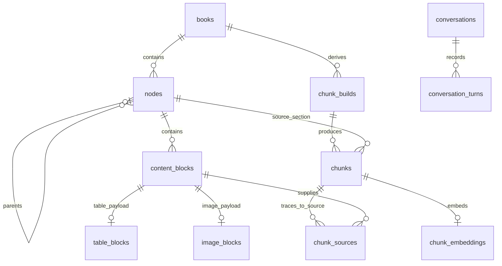

# Database schema

The schema is defined by the ordered SQL files in
[supabase/migrations](../supabase/migrations). Apply the full migration chain:
later migrations add columns, change types, and adjust constraints. This guide
maps application tables and explains the main relationships; the SQL remains
the reference for every column, default, index, foreign key, trigger, and policy.
It describes the repository schema, not the migration state of a particular
running database.

## Schemas and identity

`public` holds books/papers, retrieval data, conversations, and study artifacts.
`video` holds lectures, courses, and their evidence and conversations. These are
namespaces in the same Postgres database, not separate database servers.
`extensions` contains pgvector types. `auth` and `storage` provide the identity
and storage objects referenced by migrations; `supabase_migrations` records
which migrations have been applied.

Owner-scoped tables carry `owner_id`. On Supabase it references `auth.users`;
plain Postgres deployments create the compatibility objects through
[ops/postgres/bootstrap.sql](../ops/postgres/bootstrap.sql). After validating a
token, the API can register the same UUID through
[storage/application_users.py](../storage/application_users.py).
Composite foreign keys such as `(book_id, owner_id)` keep related records in
the same owner's scope. RLS policies are defined in migrations; deployment
role/policy behavior is also configured by
[ops/postgres/harden_runtime_role.sql](../ops/postgres/harden_runtime_role.sql).
API ownership checks remain required. See [authentication](architecture.md#authentication-and-ownership).

## Core book and paper relationships

This diagram shows a subset of foreign-key relationships. Names below are in
`public`; a paper uses the same tables as a book.



| Table | Key / important fields | Purpose |
|---|---|---|
| `public.books` | `id`, `owner_id`, `document_type`, `file_hash`, `status` | Document identity and ingestion metadata; `document_type` distinguishes books from papers |
| `public.nodes` | `id`, `book_id`, `parent_id`, `toc_index`, `node_type`, page range, `direct_text` | Hierarchical source structure and direct section text |
| `public.content_blocks` | `id`, `node_id`, `block_index`, `block_type`, `page_number`, `text_content` | Ordered canonical text/table/image blocks with page identity |
| `public.table_blocks` | `block_id`, `html_content`, `flat_text` | Table payload for a content block |
| `public.image_blocks` | `block_id`, `storage_backend`, `storage_key`, hashes, `size_bytes` | Figure metadata and private object location |
| `public.chunk_builds` | `id`, `source_book_id`, source/parser/chunker/config provenance | Rebuildable retrieval build identity |
| `public.chunks` | `id`, `build_id`, `source_node_id`, `text`, page range, `search_vector` | Searchable derived passages |
| `public.chunk_sources` | Primary key `(chunk_id, source_order)`, `source_block_id`, offsets | Exact lineage from a chunk to source blocks |
| `public.chunk_embeddings` | Primary key `chunk_id`, `embedding`, model/input provenance | Derived semantic vectors |

Base definitions: [initial schema](../supabase/migrations/20260722185652_initial_study_partner.sql).
Important later changes:

- [Paper support](../supabase/migrations/20260811120000_scientific_papers_support.sql)
  adds `document_type`; [paper roles](../supabase/migrations/20260813120000_paper_native_outline_roles.sql)
  distinguish sections/subsections from book chapters.
- [Search text](../supabase/migrations/20260801130000_chunk_search_text.sql)
  updates the derived full-text search representation.
- [Figure storage](../supabase/migrations/20260903120000_book_image_object_storage.sql)
  adds object locations; [inline-byte removal](../supabase/migrations/20260903150000_drop_book_image_base64.sql)
  removes `image_blocks.base64_content`. The initial migration alone therefore
  does not describe current figure storage.
- [Half-precision embeddings](../supabase/migrations/20260903170000_halfvec_embeddings.sql)
  changes embeddings to `extensions.halfvec`. Current application choices are
  3,072 dimensions for book text, 1,024 for video text, and 768 for video image
  regions; the book dimension constraint permits both 1,024 and 3,072.
- [Storage backends](../supabase/migrations/20260903190000_source_storage_backends.sql)
  records source/media backend ownership.

## Application table inventory

Every application table created by the migration chain is listed below. Groups
link to their creation migrations; later alterations are in the same migration
directory. Tables containing source records are distinct from derived vectors,
model outputs, caches, and operational job state.

| Area | Tables | Definition |
|---|---|---|
| Canonical books/papers | `public.books`, `public.nodes`, `public.content_blocks`, `public.table_blocks`, `public.image_blocks` | [Core](../supabase/migrations/20260722185652_initial_study_partner.sql) |
| Book retrieval | `public.chunk_builds`, `public.chunks`, `public.chunk_sources`, `public.chunk_embeddings` | [Core](../supabase/migrations/20260722185652_initial_study_partner.sql) |
| PDF jobs and events | `public.ingestion_jobs`, `public.ingestion_job_events` | [Ingestion](../supabase/migrations/20260725184500_multi_user_ingestion.sql) |
| OCR checkpoints | `public.ingestion_ocr_pages` | [OCR pages](../supabase/migrations/20260801120000_ocr_page_checkpoints.sql) |
| Figure descriptions | `public.image_captions` | [Captions](../supabase/migrations/20260728120000_figure_captions.sql) |
| Book/paper conversations | `public.conversations`, `public.conversation_turns` | [Conversations](../supabase/migrations/20260728020000_persisted_conversations.sql) |
| Study preferences | `public.study_preferences` | [Prompt profiles](../supabase/migrations/20260729090000_interview_prompt_profiles.sql) |
| Suggested-question cache | `public.suggested_questions_cache` | [Cache](../supabase/migrations/20260808140000_suggested_questions_cache.sql) |
| Lectures and resources | `video.videos`, `video.video_sources`, `video.chapters`, `video.resources`, `video.video_resources` | [Video core](../supabase/migrations/20260804100000_video_canonical_schema.sql) |
| Courses and membership | `video.courses`, `video.course_lectures`, `video.course_resources` | [Video core](../supabase/migrations/20260804100000_video_canonical_schema.sql) |
| Transcripts and supporting pages | `video.transcript_sources`, `video.transcript_segments`, `video.resource_pages` | [Video workflow](../supabase/migrations/20260804110000_video_ingestion_workflow.sql) |
| Video jobs and publication | `video.ingestion_versions`, `video.ingestion_jobs`, `video.ingestion_job_events`, `video.ingestion_stage_checkpoints`, `video.resource_suggestions` | [Video workflow](../supabase/migrations/20260804110000_video_ingestion_workflow.sql) |
| Visual and retrieval evidence | `video.frames`, `video.visual_observations`, `video.visual_regions`, `video.visual_events`, `video.evidence_units`, `video.evidence_embeddings` | [Visual evidence](../supabase/migrations/20260804120000_video_visual_evidence.sql) |
| Lecture conversations | `video.conversations`, `video.conversation_turns` | [Video conversations](../supabase/migrations/20260804130000_video_conversations.sql) |
| Uploaded captions | `video.caption_uploads` | [Caption uploads](../supabase/migrations/20260805090000_video_uploaded_captions.sql) |
| Course conversations | `video.course_conversations`, `video.course_conversation_turns`, `video.course_turn_versions` | [Course product](../supabase/migrations/20260829120000_video_course_product.sql) |
| Flashcards and review | `public.decks`, `public.deck_topics`, `public.deck_cards`, `public.deck_card_reviews`, `public.deck_review_events`, `public.deck_preferences`, `public.deck_jobs` | [Decks](../supabase/migrations/20260808180000_flashcard_decks.sql) |
| Adaptive interviews | `public.interview_sessions`, `public.interview_turns` | [Interviews](../supabase/migrations/20260809120000_interview_sessions.sql) |
| Ideal interviews | `public.ideal_interview_flows` | [Ideal flows](../supabase/migrations/20260914120000_ideal_interview_flows.sql) |
| Revision sheets | `public.revision_sheets`, `public.revision_sheet_jobs` | [Sheets](../supabase/migrations/20260905120000_revision_sheets.sql) |
| Read-aloud caches | `public.narration_figures`, `public.narration_audio` | [Narration](../supabase/migrations/20260906120000_read_aloud.sql) |
| Notifications | `public.notifications` | [Reminders](../supabase/migrations/20260821220000_review_notifications.sql) |

Reading sessions reuse `public.conversations`; watch sessions reuse
`video.conversations` via `session_kind` and `source_position`. Side chats also
reuse conversation records with parent/anchor fields, rather than requiring a
separate side-chat table. See [reading sessions](../supabase/migrations/20260819120000_reading_sessions.sql),
[watch sessions](../supabase/migrations/20260819140000_watch_sessions.sql),
[book side chats](../supabase/migrations/20260807120000_side_chat_conversations.sql),
and [video side chats](../supabase/migrations/20260808090000_video_side_chats.sql).
Saved conversation turns are authoritative history; `state_json` is a derived
resume checkpoint. `book_ids` is an array selection, not a foreign-key join table.

In the video domain, courses link to lectures through `course_lectures`;
resources link through `video_resources` and `course_resources`. Frames and
evidence are associated with ingestion versions so a replacement can be built
before publication. `evidence_units` connect searchable evidence to transcript
segments, frames/events, or supporting-resource pages; `evidence_embeddings`
adds text/image vectors. The linked video migrations define those foreign keys.

## Inspecting the applied schema

From a `psql` session connected to the target database:

```text
\dn
\dt public.*
\dt video.*
\d+ public.nodes
\d+ public.chunks
\d+ video.evidence_units
select version from supabase_migrations.schema_migrations order by version;
```

`\d+` shows actual columns, indexes, constraints, and policies after migrations.
The migration ledger identifies the applied versions. For local setup and
schema replay, see [operations](operations.md); for polling, leases, and retry
behavior, see [job queues](architecture.md#postgres-job-queues). Schema changes
require a new ordered migration and an update to this guide; already applied
migrations are immutable.
