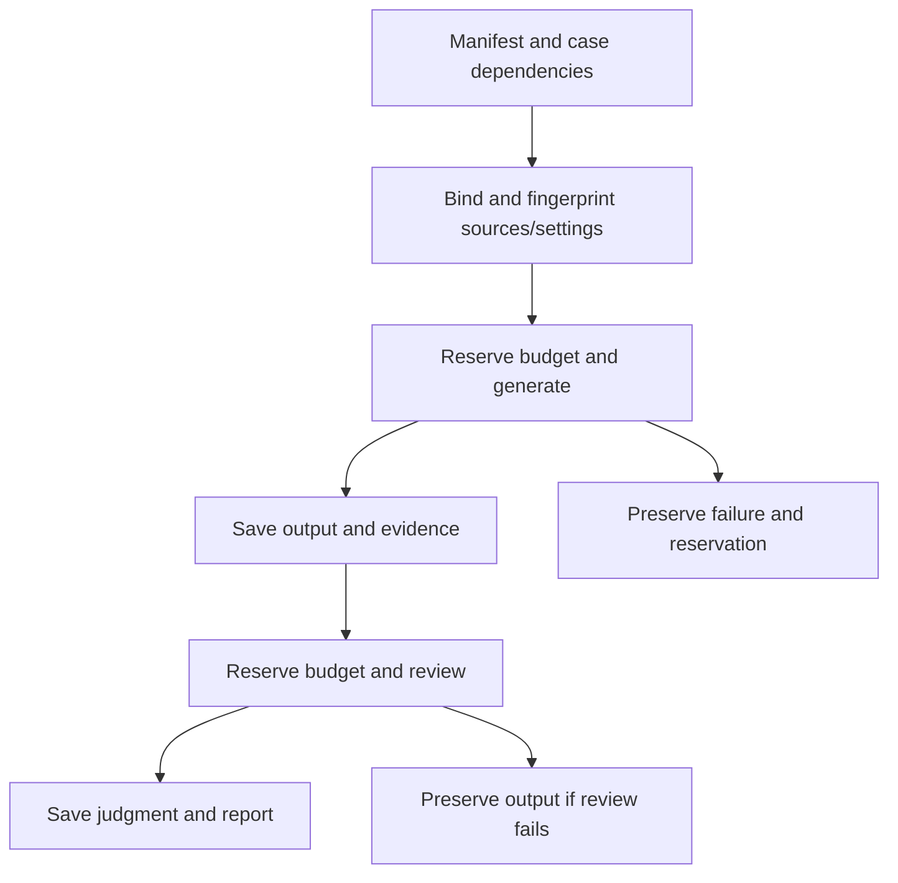

# Evaluation

Results are project-specific diagnostics, not general benchmarks. Every number
below comes from a committed dataset or sanitized result file; private run
bundles (prompts, source excerpts, images, PDFs, receipts) stay in the ignored
`evaluation/runs/` directory. Synthetic or model-reviewed data is never
treated as human-verified gold.

## How quality is judged

Three evidence layers are reported separately. Passing one does not imply
the others.

| Layer | What it establishes | How it runs |
|---|---|---|
| Contracts | Validation, scope, ownership, retry bounds, persistence, state transitions | Deterministic pytest/Vitest suites in CI; fixtures, no paid calls |
| Live quality | Whether generated outputs are correct, complete, grounded and useful | Budgeted five-flow suite on real canonical sources and real providers |
| End-to-end journeys | Browser → API → Postgres → worker paths, reopen and recovery | Isolated Chromium/FastAPI/Postgres harness with fixture auth, models and speech |

Live quality uses an LLM judge (`openai/gpt-6-luna`) that receives the exact
captured source evidence, original images, independent expected points and,
for revision sheets, every rendered PDF page. Generated pages are output to
inspect, never source evidence. Nine blinded, counterbalanced reviews by a
different model family were run to expose judge disagreement. No human
calibration is claimed; manual labels are optional.

An output is **usable** only when the judge finds source support; correctness,
coverage and usefulness each score at least 3/4; no required contract check
fails; and, for sheets, the layout is readable. Missing support, a missing
score or an unknown layout is reported as uncertain, never as a pass. A
completed request is not a quality pass.

Conversation scorers (`evidence-v2`) reject empty or fabricated citations on
grounded factual answers, check each cited page/rank or timestamp/frame/resource
against the supplied evidence, and exclude cases without required-evidence
labels from recall instead of scoring them 100%. A valid locator still does not
prove that the claim follows from the evidence; the judge checks that
separately. Judge failures keep the generated output and count separately from
application failures.

## Datasets

| Set | Size | Status |
|---|---|---|
| [Five-flow manifest](../evaluation/five_flow_manifest.json) | 54 cases: 20 chat, 7 summaries, 13 video/course, 6 sheets, 8 interviews | Reuses the sets below; course and paper expectations author-labelled |
| [Book retrieval](../evaluation/retrieval_gold_seed.json) | 15 cases: 5 exact-term, 4 paraphrase, 3 multi-section, 3 unanswerable | Expected nodes checked against canonical pages |
| [Multi-turn](../evaluation/multiturn_gold.json) | 11 conversations / 44 turns | Synthetic, separately model-reviewed |
| [Video](../evaluation/video_gold.json) | 47 turns | One lecture with linked slides |
| [Source-first anchors](../evaluation/source_first_gold.json) | 8 cases | Author-labelled |
| [Paper](../evaluation/paper_gold.json) | 2 cases (QA, complete summary); also the source for the paper sheet case | Authored from canonical content before generation |
| [Revision sheets](../evaluation/revision_sheet_gold.json) | 38 source-backed essential concepts across 5 chapters | Concept importance not human-calibrated |
| [Interview answers](../evaluation/interview_answer_seed.json) | 30 cases | Knowledge-authored; most evidence anchors await human review |
| [Interview interactions](../evaluation/interview_transcript_eval.json) | 8 cases | Synthetic turns based on public mock interviews |
| [Interview realism](../evaluation/interview_realism_seed.json) | 5 sessions | Synthetic, model judge |
| [Candidate profiles](../evaluation/interview_candidate_profiles.json) | 6 profiles | Human-authored answers |
| [Ideal interviews](../evaluation/ideal_interview_flow_seed.json) | 2 cases | Synthetic; human review outstanding |
| [OCR](../evaluation/ocr_gold.json) | 39 pages selected across 3 books | Independently transcribed |

Cards and revision sheets also store per-artifact coverage and validation
metrics. Sheets retain concept inventories, figure inspections, judge
histories, repairs and unresolved findings. These audit trails do not
establish improved learning outcomes.

## Book retrieval

Recall and MRR score the 12 answerable cases of the retrieval gold set.

| Strategy | Recall@3 | Recall@5 | MRR@5 |
|---|---:|---:|---:|
| BM25 | 81.9% | 88.9% | 91.7% |
| Vector | 90.3% | 93.1% | 79.2% |
| Hybrid RRF | 84.7% | 93.1% | 84.7% |
| Hybrid + reranker | 88.9% | 100% | 95.8% |

The reranker had 100% candidate Recall@20; multi-section Recall@5 rose from
72.2% to 100%. This justified `hybrid_rerank` as the production default on this
source, not on every corpus.
[Comparison artifact](../evaluation/retrieval_comparison_artifact.json).

## Five-flow evaluation

The five flows with deep quality coverage are grounded chat, complete
summaries, lecture/course study, revision sheets and interviews. Other
features (flashcards, suggestions, reminders, narration) have contract tests
and smoke checks, not equivalent gold-set coverage.

Book cases use BM25 in the native suite, because the evaluation budget guard
cannot bound the reranker's price; production uses `hybrid_rerank`. The two are
compared separately below.

### Results

The earliest saved run and the current code were judged with the same
source-evidence rubric on fifty cases with identical inputs, sources and
expected points. Five cases sit outside the quality denominator: three course
cases need lecture evidence that is unpublished or not yet indexed, one expects abstention where
the product deliberately offers labelled general-knowledge answers, and one
deterministic listing has no generation to judge.

| Flow | Earliest saved run | Current |
|---|---:|---:|
| Chat | 10/17 | 12/17 |
| Summaries | 3/6 | 6/6 |
| Video/course | 6/9 | 8/9 |
| Revision sheets | 0/5 | 3/5 |
| Interviews | 5/8 | 5/8 |
| **Usable** | **24/45** | **34/45** |

The earliest run completed 43/50 requests; the current code completes 49/50 on
the first attempt, and the remaining provider failure passes a separate retry
(counted in "Current"). Across the full 54-case manifest, the current code
clears 36/49 eligible cases. All six current sheet PDFs are readable; three
retain native content warnings. The earliest saved run is the first measured
evaluation, not a reconstruction of production before this work: historical
production bills and latencies were not recorded.
[Shared comparison](../evaluation/round3_historical_comparison.json).

### Changes kept

Each change targeted a failure seen in a saved run and was compared on the
same frozen cases and judge.

| Failure | Change | Measurement |
|---|---|---|
| Summaries lost the planned section identity | Carry owner-checked canonical IDs through execution | Same cases: 0/2 → 2/2 generated, valid citations, recall 1.0 |
| "Summarize the entire paper" took top-k QA | Deterministic whole/entire/complete scope grammar | Route becomes `hierarchy_summary`; recall 0.5 → 1.0 |
| Coverage repair falsely claimed details were absent | Repair receives the full canonical scope and the original answer; oversized repairs fail before a second call | Fixed-draft regression; live capture confirms full-source addendum |
| Large chapter sheets exceeded a 64k context | Use the measured 128k capacity consistently | Same chapters: 0/3 → 3/3 generated |
| Ideal dialogues rejected for missing citations | One bounded regeneration with explicit missing-marker feedback | Both cases pass nine deterministic dialogue/citation gates |
| Definitions and checklists split across chunks | Bounded neighbouring chunks from the strongest section, within the existing evidence limit | Quantization definitions 2/4 → 4/4, model-card checklist 1/4 → 4/4, both repeated; broad audits still unstable |
| Shortened answers kept stale citation records | Return metadata only for markers actually printed, with original bindings | Output-based regressions for both citation styles |
| Sheets missing essential concepts or citing uninspected figures | Recompose when an edit cannot add a concept; bind image choices to inspected IDs; one retry for an incomplete image inventory | Bounded recovery and persistent failure both verified; general failure-rate reduction not established |
| Chromium startup repeated for every layout attempt | Reuse one browser per layout search, fresh isolated context per attempt | Rendering median 4.468 s → 1.110 s, browser CPU 5.335 s → 1.479 s, identical output; no whole-sheet speedup in production |
| Sheet citations hard to read | Raise the citation font floor (~9 → 10 pt) | Six paired renders of identical content: same pages, figures and fit; no extra inference |

The summary and sheet gains in the results table come from these changes
combined; individual causal contributions are not isolated. Evaluation also
surfaced plain defects, each fixed with a reproducing regression: an SDK
default that selected an unpriced transport, a video starter-question SQL
error, and a contracted refusal (`isn't enough evidence`) classified as an
answer.

### Experiments rejected

A further twenty single-change candidates were screened against an unchanged
control, with matched repeats and alternate-model review for anything that
looked promising. Only larger citations was adopted.

| # | Change | Result |
|---:|---|---|
| 1 | DeepSeek V4 Flash writes answers | Coverage and source-support gaps |
| 2 | Qwen3.5 Flash writes answers | Coverage and source-support gaps |
| 3 | Luna Pro writes difficult answers | Luna judge favoured it; blinded Gemini review did not confirm; dearer and slower |
| 4 | Gemini 3.1 Flash Lite writes answers | Incomplete summaries and course coverage |
| 5 | DeepSeek chooses the chat route | Structured-response failures and provider overload broke conversation chains |
| 6 | Qwen grades interview answers | All six cases failed in three protocol attempts |
| 7 | Qwen drafts revision sheets | Repair structures still failed |
| 8 | Gemini reads source figures | Initial gain did not repeat |
| 9 | Preserve key terms in rewritten questions | Did not repair broad-audit coverage |
| 10 | Boost exact section titles in BM25 | Hurt definition and control cases |
| 11 | Split neighbouring context across two sections | Broad audit remained incomplete |
| 12 | Hybrid lexical + vector search without reranking | Did not fix the target omission |
| 13 | Include adjacent lecture passages | Spanner mechanism coverage remained incomplete |
| 14 | Allocate summary length by section | Initial gain did not survive repeats |
| 15 | Carry sheet qualifications separately | Native content warning remained |
| 16 | Prefer balanced sheet layouts | Same layouts selected, with extra attempts |
| 17 | Larger sheet citations | **Kept** (above) |
| 18 | Cache figure readings and inventories | Existing saved-sheet reuse already covers repeated opens |
| 19 | Grader lists requested points before scoring | Uncertain judgments and a fabricated quotation rejection |
| 20 | Concrete reasoning guidance for ideal answers | Reasoning-signal failure remained |

Also rejected: an extra interview grading instruction (no reliable benefit;
over-credited mixed answers, so the original prompt was restored) and an
earlier routing change that lowered route accuracy 84.1% → 81.8%, scope
accuracy 70.5% → 65.9% and outcome accuracy 81.8% → 79.5% on the multi-turn
set. Luna therefore remains the default for answers, routing, grading and revision sheets.
[All candidate measurements](../evaluation/round3_screen_results.json),
[model screens](../evaluation/round3_model_screen_results.json),
[paired renders](../evaluation/round3_free_render_results.json).

### Production before and after

The same real account, questions, source selections and canonical fingerprints
were run on the deployed application before and after the kept changes
shipped. Production uses `hybrid_rerank`. One observation per scenario is
descriptive, not a percentile or causal benchmark.

| Scenario | Before | After | Observation |
|---|---:|---:|---|
| Responsible-AI audit | 9.6 s | 16.1 s | Fuller model-card checklist, seven cited sources; one unrelated figure remains |
| Complete Transformer-paper summary | 25.7 s | 30.2 s | Both complete |
| Cold paper sheet | 182.5 s | 184.9 s | Both three pages; after has one native content warning |
| Video BLEU question | 5.8 s | 4.7 s | Both correctly say the lecture lacks the score |
| Selected Spanner lecture | 3.5 s | 3.1 s | Both cite consistency and admit the missing TrueTime mechanism |
| Chapter-1 ideal interview | 85.7 s cold | 0.03 s cached | Saved flow reused; not faster fresh generation |

Synchronous times are web HTTP completion; the sheet time is enqueue-to-ready.
A complete adaptive interview on a 102k-character chapter, answered with
synthetic weak answers, finished naturally after 18 answers, covered 9/9
planned areas and cost $0.022 in 44 provider receipts. [Production pairs](../evaluation/round3_production_comparison.json).

### Cost

Each experiment ran under a $1–2 ceiling enforced before every request.
Recorded provider receipts are $1.02 for the first baseline and its fixes,
$3.90 for the five-variant comparison that selected most kept changes, and
$3.87 for the twenty-candidate screen and production comparison (plus $0.10
still reserved for unknown receipts).

For a light month of 100 chats, five summaries, three sheets, two interviews
and twenty video/course questions, the forecast is **about $0.93** with one
search per chat and **$1.25** with two, including 20% headroom and the most
expensive observed per-flow costs. Voice and arbitrarily large chapters are
excluded; this is a usage assumption, not a spending cap.
[Forecast and assumptions](../evaluation/round3_monthly_forecast.json).

## Evaluation harness



| Component | Responsibility |
|---|---|
| [suite.py](../evals/suite.py) | Case dependencies, phase persistence, integrity checks, run lock, resume |
| [adapters.py](../evals/adapters.py) | Bind canonical sources and call native feature code without persisting user artifacts |
| [suite_judge.py](../evals/suite_judge.py) | Source-backed review and rendered-sheet criteria |
| [budget.py](../evals/budget.py), [round_budget.py](../evals/round_budget.py) | Per-request reservations, frozen pricing, receipts, child ceilings |
| [automated_reviews.py](../evals/automated_reviews.py) | Re-review immutable saved outputs without regenerating |
| [review_server.py](../evals/review_server.py) | Loopback viewer for outputs, evidence and PDFs; optional hash-bound manual labels |

- **Frozen inputs.** Source files, canonical content, images, retrieval
  builds, datasets, implementation bytes and prompt-affecting settings are
  fingerprinted. Any drift rejects a resume; a changed experiment needs a new
  output directory.
- **Budget.** Generation, judging, embeddings and retries share one ledger.
  Each reservation is written before the request; timeouts and missing receipts
  keep their reservation rather than becoming zero. During a run an httpx
  transport guard bounds output tokens and provider price and refuses unpriced
  models, fallbacks and paid tools. The guard is evaluation-only and never
  installed in the serving API.
- **Resume.** Outputs are saved before judging. Re-running a command reuses
  completed outputs and retries only failed judgments; failed generation needs
  an explicit `--retry-failed`.
- **Timing and cost.** Each case gets a LangSmith root in a
  `study-partner-evals-<run>` project. Latency, tokens and cost come from trace
  readback, counting physical model calls once; provider receipts govern spend.
  Python CPU and sampled RSS exclude child browsers and remote inference.

## Other measured behavior

These results predate the five-flow suite and `evidence-v2` scoring and have
not been recomputed under it.

| Area | Recorded result | Qualification |
|---|---|---|
| Video QA | Required-evidence recall 75.0% → 90.0%; cited-evidence recall 38.5% → 77.5% | 29 versus 43 turns, not a paired comparison |
| Video final run | Route/outcome/citation validity 100%; no execution errors | 43 turns, one lecture with linked material |
| Lecture summary | 24/24 stretches cited; 23/24 substantively covered | Same video evaluation |
| Follow-up rewriting | Mean anchor recall 56.3% → 87.5% | 16 follow-ups; helped 7, hurt 2, unchanged 7 |
| Source-first chat | Anchor recall/order 100%; selection resolution 87.5%; rung accuracy 5/7 | Author-labelled expectations |
| Interview interaction | Development 1/4 → 4/4; held-out 4/4 | Synthetic turns |
| Interview realism | 60% → 100% rescored | 5 synthetic sessions, model judge |
| Candidate calibration | 4/6 profiles passed; completed score ladder monotonic | 2 provider failures |
| OCR character error | Tesseract 37.91%; Gemini 14.73%; Qwen 14.80% | 35 scored pages across 3 books |
| Reader geometry | 809/810 figures aligned with node text pages; 97/119 citations matched text exactly | Highlighting misses fall back to page focus |

Video gains came from modality balancing, timeline coalescing and query
rewriting; damaged text in the linked slide deck and the lack of an
independent answer judge limit the result. Qwen and Gemini tied on aggregate
OCR error: Qwen was better on prose, Gemini on difficult pages, so Qwen is the
ingestion default. Embedding size and precision measurements are in
[design decisions](design-decisions.md#embedding-size-and-precision).

## Limitations and open failures

- Remaining five-flow failures: support and coverage on broad answers,
  unrelated figures in chat, unpublished course lectures and missing TrueTime
  evidence, sheet content warnings, and interview reasoning consistency.
- The judge is from the same model family as the generator and has no human
  calibration; generation and judge variation between runs is material.
- Samples are small: no representative latency/cost percentiles, no
  first-content latency for buffered generation, no learning-outcome study, no
  labelled figure-relevance set.
- Native suites do not establish ingestion, live audio, load or provider-outage
  behavior.
- LangSmith's monthly unique-trace quota blocked hosted readback in the last
  experiments; those report local SDK intervals and provider receipts, labelled
  as such. 47 trace costs in the five-variant comparison are lower than provider receipts
  and remain unreconciled; receipts are used for spend.

## Reproduce

Commands need the canonical sources/database and provider keys. Live
generation and judging make paid calls. A clean clone has only the sanitized
results; private run bundles are local. Each runner documents options with
`--help`.

| Evaluation | Command |
|---|---|
| Five-flow coverage plan (no inference) | `uv run --frozen --extra voice python -m scripts.run_evaluations --plan` |
| Manifest regenerate / check | `uv run --frozen --extra voice python -m scripts.build_eval_manifest [--check]` |
| Budgeted five-flow suite | `uv run --frozen --extra voice python -m scripts.run_evaluations --live --output evaluation/runs/NEW_RUN --max-usd 2` |
| Re-review saved outputs | `uv run --frozen --extra voice python -m scripts.judge_saved_evaluations --output evaluation/runs/NEW_REVIEW --max-usd 1` |
| Review viewer | `uv run --frozen --extra voice python -m scripts.review_evaluations evaluation/runs/RUN --port 8766` |
| Retrieval (all modes by default; `--modes` to select) | `uv run python -m scripts.evaluate_retrieval` |
| Retrieval report | `uv run python -m scripts.build_retrieval_report`; `uv run python -m scripts.render_retrieval_report` |
| Anchors / source-first | `uv run python -m scripts.evaluate_source_first --resolution-only --all`; omit `--resolution-only` for generation |
| Multi-turn | `uv run python -m scripts.validate_multiturn_gold`; `uv run python -m scripts.evaluate_multiturn --all` |
| Video | `uv run python -m scripts.evaluate_video --all --owner-id "$VIDEO_OWNER_ID"` |
| Interview answers | `uv run python -m scripts.evaluate_interview_answers --smoke --judge-answers` |
| Interview realism | `uv run python -m scripts.evaluate_interview_realism --all --judge` |
| Interaction / calibration | `uv run python -m scripts.evaluate_interview_interactions --split held_out --judge`; `uv run python -m scripts.evaluate_interview_candidate_calibration` |
| Ideal interviews | `uv run python -m scripts.evaluate_ideal_interview_flows --judge` |
| OCR | `uv run python -m scripts.evaluate_transcription select`; then `transcribe`, then `score` |

Use `--case` or `--flow` to select a subset; `--retrieval-mode` defaults to
`bm25`. Harness integrity, budget and viewer tests run without paid calls:

```bash
LANGSMITH_TRACING=false OTEL_ENABLED=false uv run --frozen --extra voice \
  python -m pytest tests/test_eval_reviews.py tests/test_eval_adapters.py \
  tests/test_eval_suite.py tests/test_eval_budget.py tests/test_eval_integrity.py -q
uv run --frozen --extra voice python -m tests.check_eval_review_browser
```
