# Study flows

These flows describe implemented behavior. LangGraph coordinates decision
loops; some generation routines use bounded Python loops. Parsing, scope
loading, scheduling, and persistence remain deterministic.
Source processing: [ingestion](ingestion.md).
Exact LangGraph topology, exported from the executable workflows:
[LangGraph workflows](langgraph.md). The diagrams below describe product flows
and can include work inside or outside individual graph nodes.

## Questions

### Books and papers

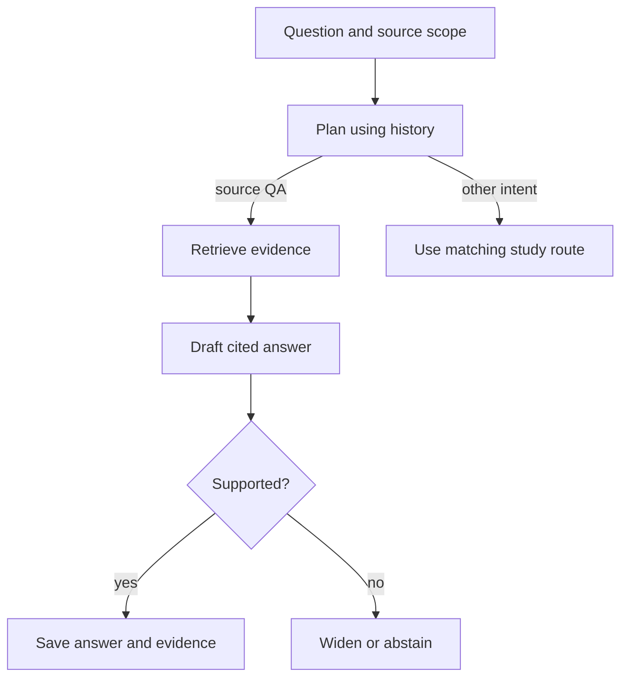

The selection defines which books/papers can be searched. Explicit book
mentions set a turn's search scope without changing the saved selection.
Other routes explain/list/read a complete scope, clarify ambiguity, transform
a previous answer without new facts, or answer externally. History resolves
follow-ups. Quick QA uses 5 chunks; deeper/interview answers use 8. Citations
resolve to source sections/pages, not generated prose.

Code: [study graph](../study/graph.py), [turn execution](../study/conversation.py),
[QA](../study/query.py). Search mechanics: [architecture](architecture.md#retrieval).

### Source widening and external answers

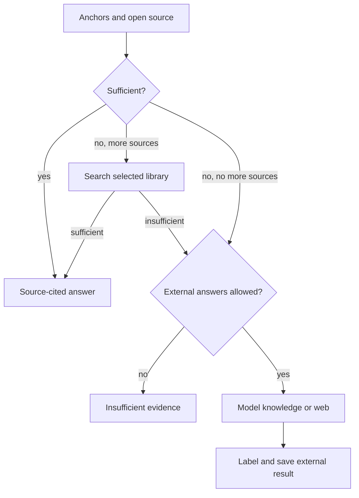

Source-first turns use a finite open-source → selected-library → external
ladder. Each widening and reason is saved. `stay_in_source` stops retrieval
escalation into model/web answers; policy sets the permitted sources. Ordinary chat
can fall directly from failed source QA into external QA without that ladder.

Explicit web requests and recency signals trigger search; otherwise a control
model checks whether general model knowledge is sufficient. Tavily is used
when configured, with DuckDuckGo fallback. Web answers cite returned links;
model-knowledge answers are labelled ungrounded. Neither borrows book citations.

Code: [grounding policy](../study/grounding.py), [external QA](../study/external_qa.py),
[web search](../retrieval/web_search.py).

### Lectures and courses

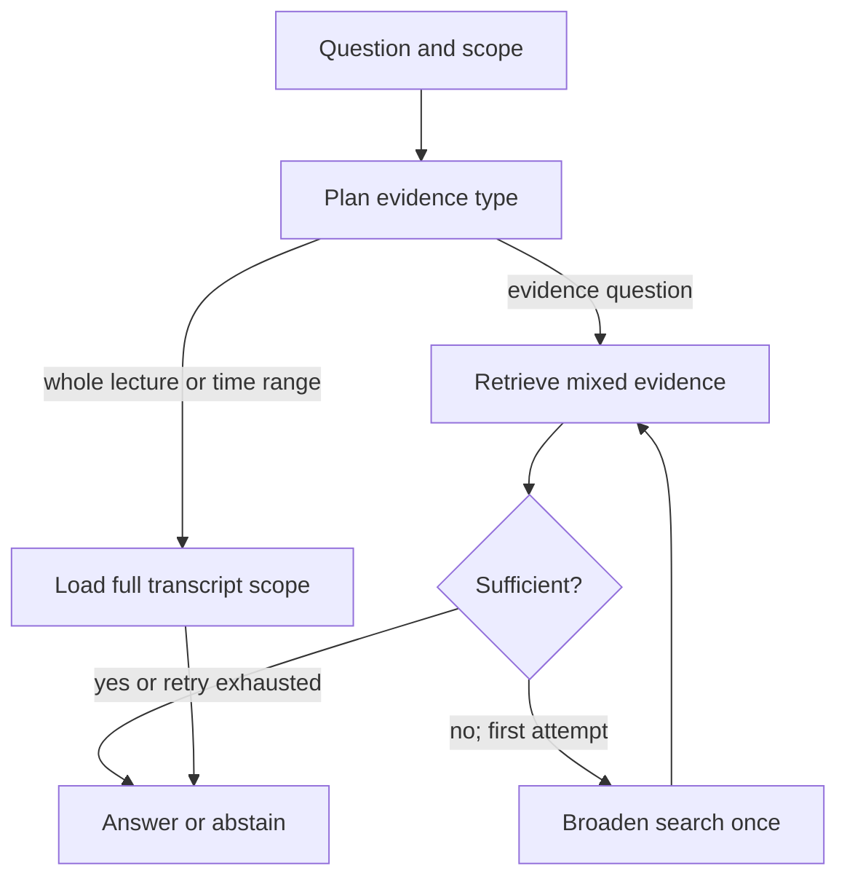

Visual questions require visual or supporting-page evidence. Lecture retrieval
widens from 8 to 16 items and a 60- to 180-second window. Course QA searches
published lectures with per-lecture caps: 12/4 initially, 20/6 on retry. Excluded
lectures and source versions are recorded. Prior-answer transforms and
clarification avoid unnecessary retrieval.

Code: [lecture graph](../video/conversation.py), [course graph](../video/course_conversation.py).

## Reading and side chats

### PDF reading mode

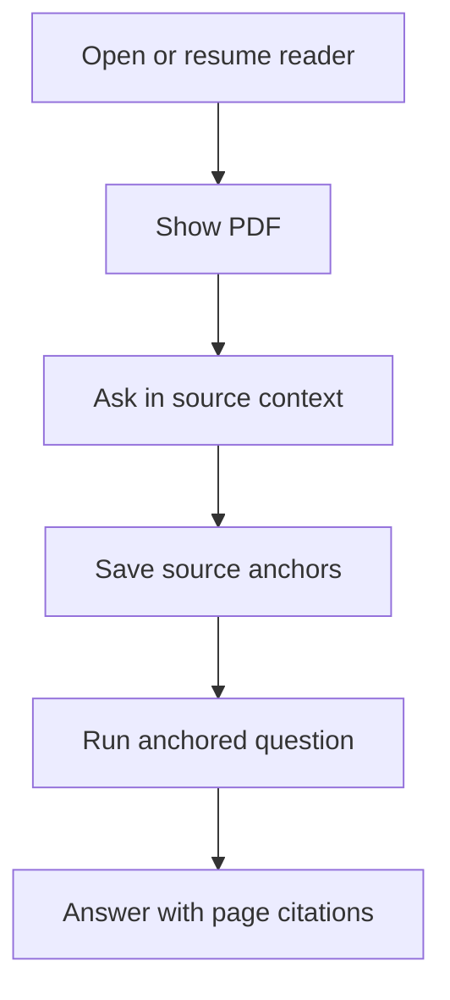

The page composer supplies page context; selections and chapter choices supply
more specific anchors. One reading session per source stores position and
question threads. Citation navigation opens the source location; unresolved
text highlighting falls back to page focus.

Code: [reader](../frontend/app/read/%5BbookId%5D/page.tsx),
[session storage](../storage/conversations.py), [reading API](../api/main.py).

### Anchored side chats

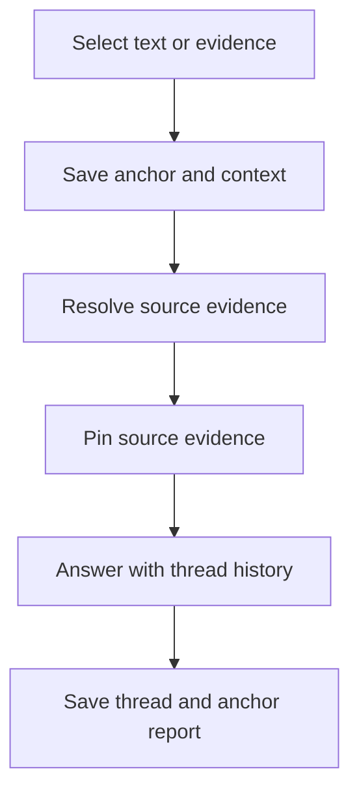

Book pages, passages, sections, lecture moments, and card citations can anchor
a thread. Prior answer text is context; its resolved source evidence is what
can be cited. Missing/stale anchors are reported. Page-anchored book chats can
use the source-first policy; answer-only anchors do not activate that ladder.

Code: [anchor resolution](../study/anchors.py), [context assembly](../study/side_context.py),
[video context](../video/side_context.py), [card context](../decks/conversation.py).

## Complete summaries

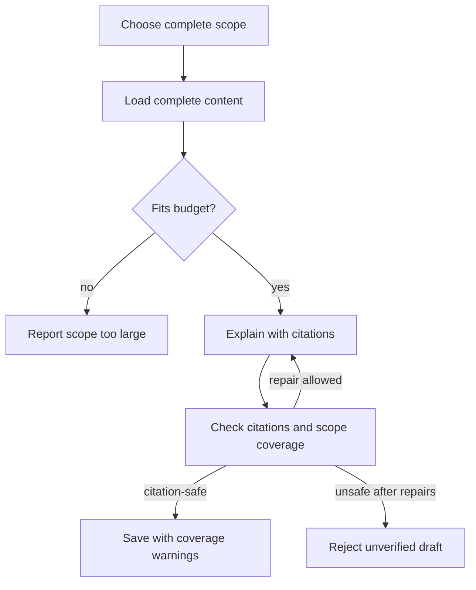

Chapter explanations load the complete subtree; papers load the complete
paper, and lectures load the selected transcript scope. Top-k retrieval cannot
prove coverage. Book/paper summaries allow up to two repairs for citation or
coverage defects. Coverage checks measure referenced source units, not
claim-level truth. A citation-safe draft can retain coverage warnings after
repairs; unsafe citations fail. Over-budget scopes are not silently truncated.
Coverage repairs receive the full canonical scope and preserve the original
answer; oversized repair inputs fail before another model request. Measured
coverage gains and remaining gaps: [evaluation](evaluation.md#changes-kept).

Code: [scope loading](../study/scope.py), [summary checks and repair](../study/summarize.py),
[lecture scope](../video/lecture.py).

## Verbatim reading

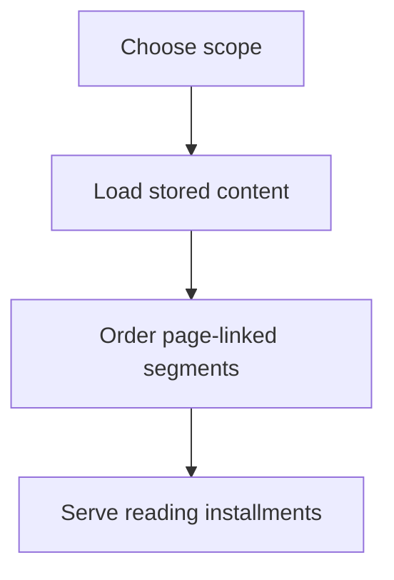

No model generates the passage. Verbatim means reproduction of parsed/OCR
content, not a byte-exact PDF copy. Non-content/decorative blocks are omitted
and counted. Default installments contain about 6,000 characters; oversized
segments remain whole. Excessively large requests are rejected.

Code: [reading](../study/reading.py), [passage API](../api/main.py).

## Flashcards

### Creation

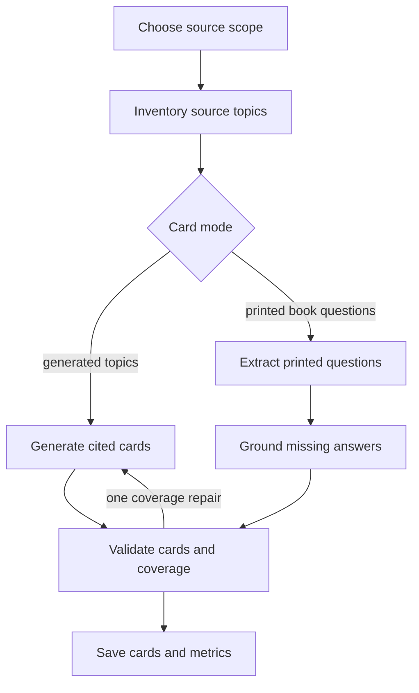

Scopes are book chapters, complete papers, or lectures. Generated-card coverage
uses cards that survive validation, not model labels.
Extracted cards retain printed-question identity and answer provenance.
Enabled, eligible sources automatically queue initial sets after publication;
a periodic reconciler recovers missed enqueue hooks without duplicate sets.

Code: [pipeline](../decks/pipeline.py), [generation](../decks/generate.py),
[printed questions](../decks/extraction.py), [automation](../decks/source_preferences.py).

### Review scheduling

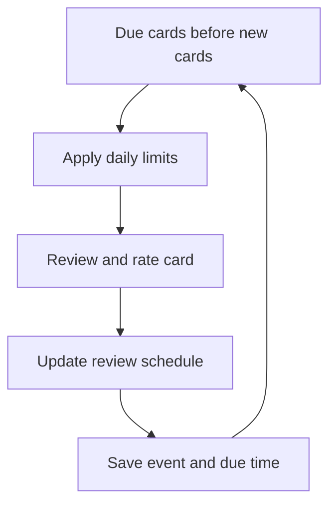

Scheduling is deterministic SM-2-style logic with a 10-minute learning/relearning
step, ease floor, and interval cap. Daily counts use the configured timezone.
The card side chat explains cited evidence without changing the schedule.

Code: [scheduler](../decks/scheduler.py), [review persistence](../decks/store.py).

### Daily notifications

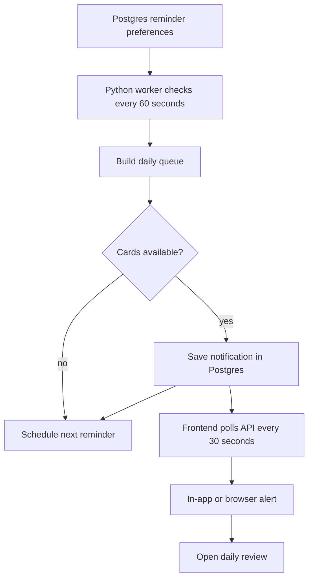

Daily reminders use plain Python scheduling logic and Postgres persistence.
The long-running `python -m worker.main` process starts a separate
`daily-card-reminders` thread, checks immediately, and waits 60 seconds between
passes. This thread shares the ingestion/card/revision worker process but runs
independently of long queue jobs. The Railway worker configuration starts this
same process. An API-only process does not create reminders; `--once` processes
at most one queue job and does not start the reminder loop. There is no Celery,
Redis, external scheduler, or notification delivery service in this flow.

`public.deck_preferences` stores opt-in status, local reminder time, IANA
timezone, and the next due instant (`next_review_reminder_at`). These preference
rows act as the reminder claim queue rather than a separate jobs table. Each
pass selects due rows with `FOR UPDATE SKIP LOCKED`, builds each owner's review
queue, and inserts into `public.notifications` only when cards are available.
It then advances the next due instant to a future occurrence. Reminders default
to disabled. A unique `(owner_id, kind, dedupe_key)` identity, with the owner's
local date as the key, prevents duplicate daily events. Missed days do not
create a backlog; after downtime the worker considers the current local day's
queue and schedules the next occurrence.

The notification center reads owner-scoped records through
`GET /api/notifications` every 30 seconds, on mount, and when the page regains
focus or visibility. It supports read/dismiss and opens the Today review queue.
Optional desktop alerts use the browser's built-in `Notification` API with
permission and the running app. A closed app receives no background push;
persisted notifications remain available when it is reopened. There is no
email delivery.

Code: [worker loop](../worker/main.py), [Railway worker configuration](../railway.worker.json),
[reminder reconciliation](../notifications/reminders.py), [notification store](../notifications/store.py),
[notification API](../api/notifications.py), [scheduling helpers](../decks/review_time.py),
[schema migration](../supabase/migrations/20260821220000_review_notifications.sql),
[notification UI](../frontend/components/notifications/notification-center.tsx).

## Revision sheets

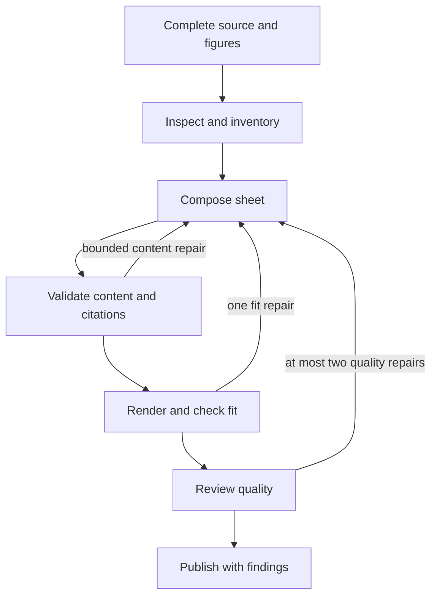

No source sampling or top-k retrieval is used. Context overflow, invalid
content, and unrecoverable layout failures fail the job. Unresolved quality
findings after the repair budget remain visible in provenance. Repairs preserve
existing item identities; saved artifacts include PDF/HTML, inventory, figure
inspection, and review history. Follow-up QA reloads the original complete
chapter/paper and validates its citations.

The layout is `html-a4-flow-v5`, with a raised citation font floor. One
Chromium process is reused within a layout search, with a fresh isolated
context per attempt. Opening a compatible saved sheet reuses it; explicit
regeneration creates a new version and preserves the old one. Readability does
not prove completeness: native content warnings remain visible.

Code: [generation graph](../revision_sheets/generate.py), [rendering](../revision_sheets/render.py),
[sheet QA](../revision_sheets/ask.py).

## Interviews

### Session and question creation

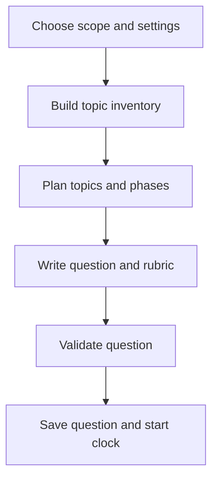

Planning is deterministic; models write questions and rubrics. Formats cover
concepts, system design, and source-led practice. Realistic/guided modes control
feedback and assistance. Source coverage grounds assessment while question
wording can frame a practical interview scenario.

Code: [service](../interviews/service.py), [planning](../interviews/planning.py),
[question generation](../interviews/question_generation.py).

### Adaptive interview

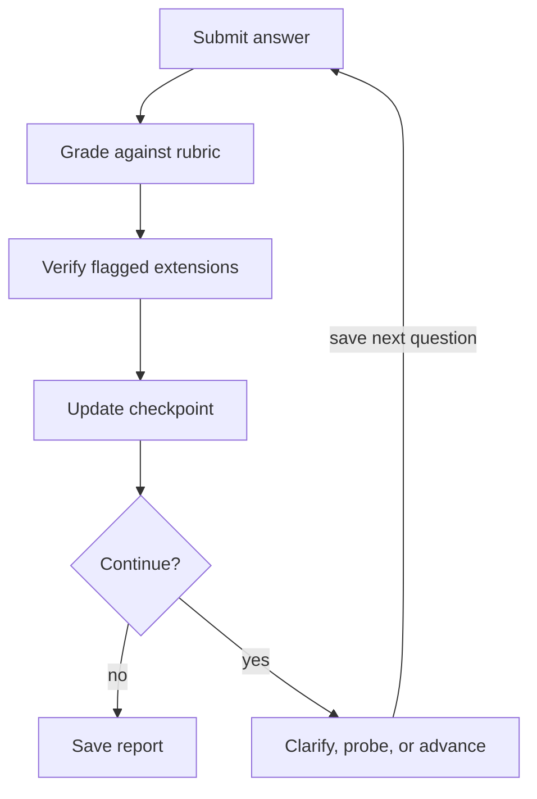

Each criterion is scored 1–5: correctness 30%, depth 20%, reasoning 15%,
tradeoffs 15%, clarity 10%, independence 10%. Structured completion/probe flags
and correctness/depth scores determine the route; a single aggregate score does
not choose the next question. A topic normally receives one primary question
and at most one focused follow-up. System-design phases can revisit a topic
for a different design decision. Unverified extensions cannot improve a score.

Clarification requests and optional code/screen observations feed the saved
session. Audio transcription fills an editable draft; only submission advances
the API state. The report records evaluated answers, scores, coverage, and
revision areas. Voice transport: [interview voice](interview-voice.md).

Code: [answer graph](../interviews/graph.py), [score contracts](../interviews/contracts.py),
[evaluation validation](../interviews/evaluation.py).

### Ideal chapter interview

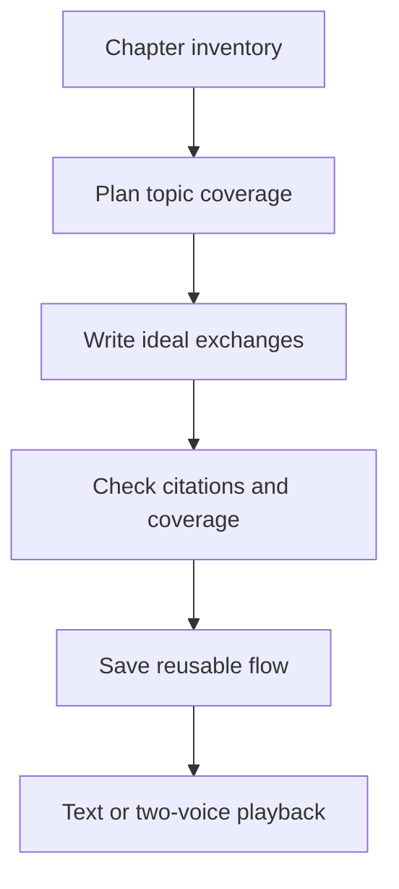

This is a listen-only study artifact, without candidate grading. Each assigned
topic appears once; failed exchanges allow at most two generation attempts.
Reuse is keyed by scope, format, level, model, and prompt version.
Matching concurrent generations serialize on an owner/scope/settings
Postgres advisory lock; the waiting request reuses the saved result without
another model call. The web proxy allows up to ten minutes for the synchronous
response. This prevents duplicate saves when a client disconnects and retries,
but generation is not a resumable job and does not survive process restart.

Code: [ideal generation](../interviews/ideal_generation.py), [ideal service](../interviews/ideal_service.py).

## Read-aloud

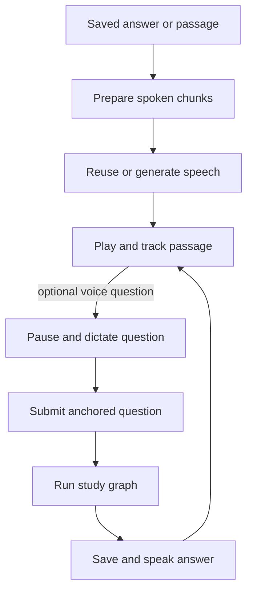

The client prepares a narration script from existing content; server APIs
provide speech and source-grounded figure descriptions. Audio is cached by
owner/content/model/voice. Optional LiveKit carries interruptions and saved
side-chat speech; it does not generate answers independently.

Code: [narration script](../frontend/lib/narration.ts), [speech API](../api/narration.py),
[figure descriptions](../narration/figures.py), [voice worker](../narration/voice_worker.py).
