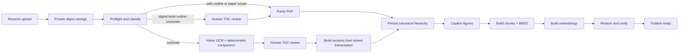
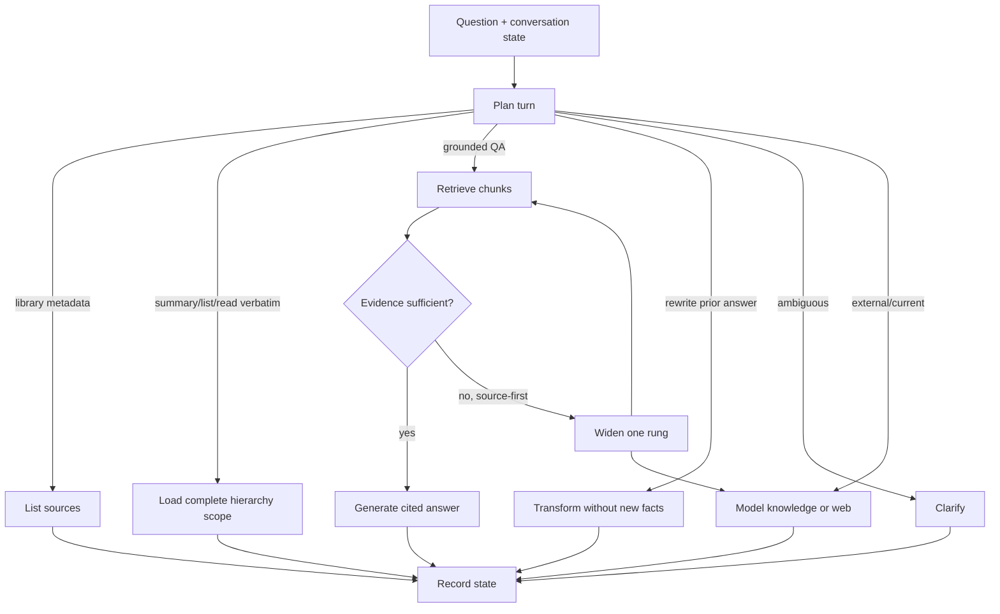
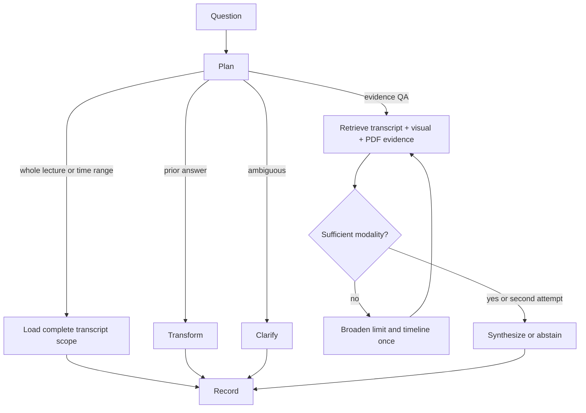
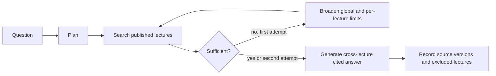
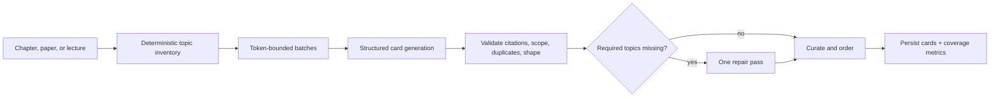
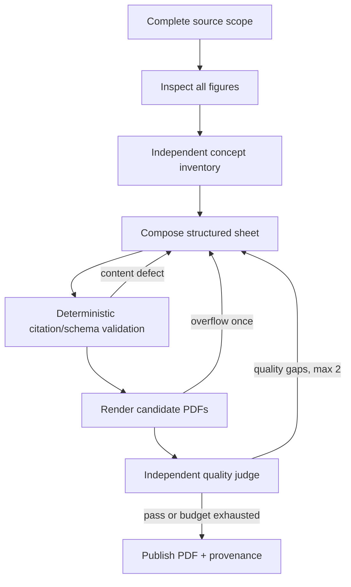
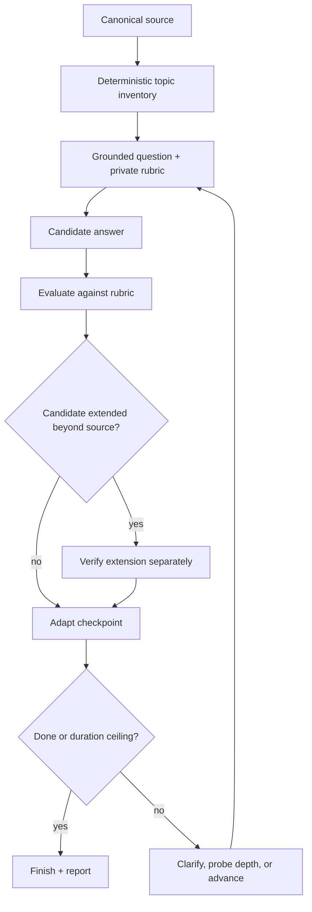
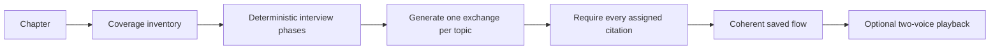

# RAG and agent flows

These diagrams describe current code paths. “Agentic” means a graph makes an
explicit decision or bounded retry; deterministic ingestion remains ordinary
Python on purpose.

## 1. PDF and paper ingestion

The worker validates structure, text volume, canonical restoration, chunk
lineage, and one embedding per chunk before a source becomes selectable.
Papers may fall back to one whole-document scope; books with uncertain chapter
boundaries pause for review rather than inventing a hierarchy.
See the [ingestion guide](ingestion.md) for separate digital-book,
scanned-book, paper, and video diagrams with their checkpoints and limits.

## 2. Book and paper conversation

Implemented by `study/graph.py`.

The source-first ladder is finite: anchored passage/open source → selected
library → model knowledge, with live web search available inside external QA
for current or explicitly web-bound questions. A “stay in this source” lock
stops widening and preserves the abstention. Each widening and its reason is
stored on the turn.

Book QA uses 5 chunks for quick answers and 8 for deeper/interview answers.
System-design questions may keep multiple chunks from one broad hierarchy
node; other concept queries prefer node diversity. Citation markers resolve
back to canonical node/page spans.

## 3. Single-lecture RAG

Implemented by `video/conversation.py`.

Visual questions require visual or resource-page evidence; transcript-only
matches are not treated as sufficient. The retry grows the evidence limit from
8 to 16 and the timeline window from 60 to 180 seconds, then terminates.

## 4. Course-wide RAG

Implemented by `video/course_conversation.py`.

The first pass returns up to 12 items with at most 4 per lecture; the retry
uses 20 and 6. Unpublished lectures are excluded and reported, not silently
treated as empty.

## 5. Flashcard generation

Implemented by `decks/`.

Coverage is computed from cards that survive validation, not from the model's
declared topic labels. A card whose citations cross unrelated topics is
dropped. One repair pass is allowed; repeated calls over the same evidence are
not an open-ended agent loop.

## 6. Revision-sheet generation

Implemented by `revision_sheets/generate.py`.

No source text is retrieved or sampled: the complete selected scope must fit
the configured budget. Repairs preserve item identities and are bounded.
Unresolved judge findings are published as provenance rather than hidden.

## 7. Adaptive interview

Implemented by `interviews/graph.py` and `interviews/service.py`.

Planning and source coverage are deterministic. The model writes grounded
questions and evaluates answers; the graph limits each topic to one primary
question plus at most one focused follow-up. The next route is based on
structured scores and explicit clarification/depth flags. Optional speech and
screen checkpoints do not replace the saved text/rubric state.
The [interview voice guide](interview-voice.md) traces the LiveKit room, STT,
TTS, frontend draft, and API handoff for this same adaptive session.

## 8. Ideal chapter interview

This is a generated listen-only study artifact, not a candidate evaluation.

Every topic is assigned exactly once; structured citation markers are checked
outside the spoken text. A failed exchange gets at most two generation
attempts. Successful flows are reusable by scope, format, level, model, and
prompt version.

## 9. Read-aloud and anchored side chats

Narration reads canonical passages or already-saved grounded answers. Speech is
chunked, cached by content/model/voice, and synchronized to source passages;
figure descriptions are generated and cached separately. LiveKit can accept an
interrupting voice question, which becomes an ordinary anchored side-chat turn
through the same study graph. Narration itself is not allowed to invent or
retrieve new claims.
