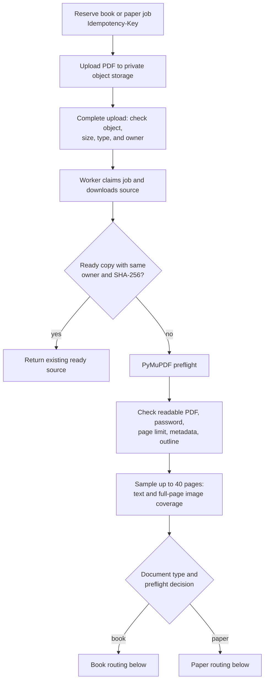
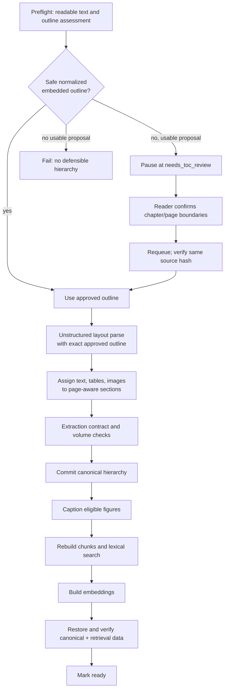
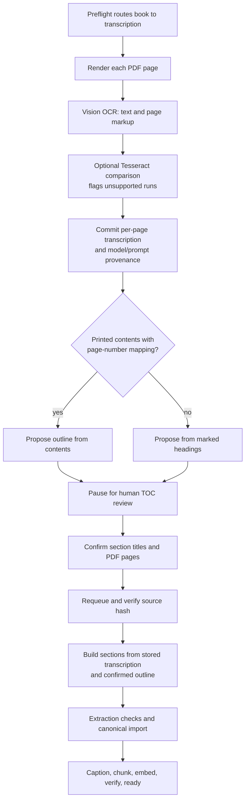
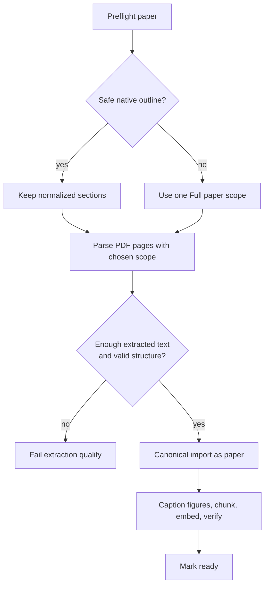
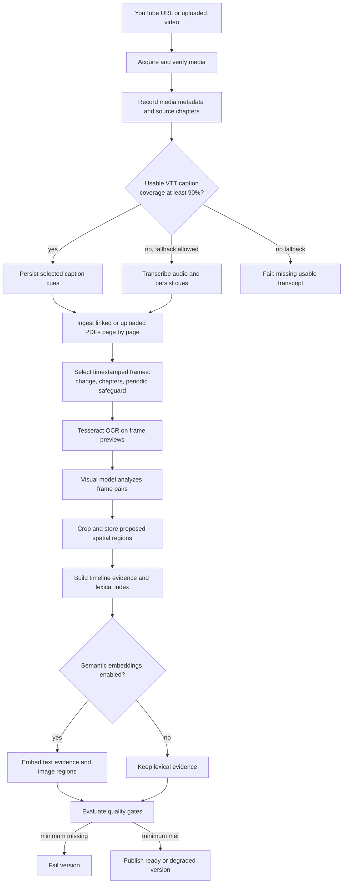

# Ingestion: books, papers, and lectures

This guide follows the implemented worker paths. PDF **books** and **papers**
share an upload queue and canonical content model, but have different outline
rules. Videos have a separate versioned queue. Ingestion is deterministic Python;
LangGraph runs later, when a study request needs planning or a bounded retry.

## Shared PDF entry and preflight

The API reserves an owner-scoped immutable upload path; completing the upload
queues the job. The worker checks the stored bytes again and hashes the source.
Preflight treats a sampled page as text-bearing at **48 extracted characters**.
Text coverage at or below **20%** is `scanned`, below **80%** is `mixed`, and
higher coverage is digital. A full-page image with an overlaid text layer on
at least **80%** of sampled pages is treated as likely OCR-backed. Outline
quality is checked separately; a digital PDF can still have an unsafe outline.
These thresholds and the preflight version are recorded in job provenance.
Encrypted, unreadable, empty, or over-limit PDFs fail before expensive parsing.

### Digital book PDF

The parser uses the approved outline rather than rereading raw publisher
bookmarks. It runs layout extraction over page batches, then assigns blocks to
sections. The extraction gate checks that the resulting section list matches
the outline, has at least 200 characters overall, and has text in enough
sections. Canonical import stores hierarchy nodes, text blocks, tables, and
image records in one transaction. Figure captions, chunks, search data, and
embeddings are derived from those records. Figure caption failure is recorded
and does not fail an otherwise usable book.

### Scanned, mixed, or OCR-backed book PDF

This branch also handles a text-bearing PDF whose apparent text is an OCR
overlay, or whose embedded outline is poisoned. Each page transcription is a
durable checkpoint keyed to the OCR model and prompt, so a retry can reuse
finished pages. The comparison with local Tesseract is **advisory**: it adds
review warnings or marks a page unassessable; it does not silently replace
vision text or block ingestion. Printed contents and detected page numbering
are preferred for the proposed hierarchy; marked headings are the fallback.
If no usable proposal exists, the job fails instead of waiting on an empty
review. After confirmation, structure is built deterministically from the
stored transcription, without rerunning the PDF layout parser. The confirmed
outline and printed-to-PDF page mapping stay in canonical provenance.

### Paper PDF

A readable paper does not need invented chapter boundaries or human TOC
review. It keeps trustworthy native sections when available; otherwise the
entire document is one `Full paper` scope. Its title resolves from PDF
metadata, then a page-one `Title` block, then the filename. The same
canonical, indexing, and final verification stages used for books follow.

**Current scanned-paper limit:** paper routing does not enter the book vision
transcription and TOC-review branch. It attempts the PDF parser with a
whole-document scope when the outline is unsafe. An image-only paper can fail
the extraction-quality gate; successful scanned-book ingestion does not imply
equivalent scanned-paper support. Linked PDFs attached to a video are another
path: they are extracted page by page with PyMuPDF as supporting resources,
not ingested as standalone papers.

## Video lecture ingestion

The acquire stage verifies an uploaded object or downloads YouTube media,
then promotes it to canonical private storage with a content hash. Metadata
includes duration, stream properties, title, and any source chapters. The
transcript stage parses uploaded and acquired WebVTT candidates, measures
coverage, and selects the best eligible candidate. Below 90% coverage it can
use paid audio transcription when the course or request permits it and the
job has budget. Linked or uploaded PDFs become page evidence; a failed
supporting PDF is recorded on that resource and does not fail the entire
resource stage.

Frame selection samples the timeline, keeping meaningful visual changes,
source chapter boundaries, and periodic safeguards while suppressing near
duplicates and applying an hourly limit. Selected full frames and previews
are stored with timestamps. Tesseract reads preview text; the visual model
adds observations and technical details. Spatial regions are cropped from
those observations. The evidence build combines transcript segments, visual
frames/events, and resource pages into a timestamped, source-linked search
space. Semantic text and image embeddings are conditional on course settings;
lexical search remains available when disabled.

The final gate requires a ready canonical source, enough transcript coverage
or an acceptable maximum cue gap, complete transcript evidence, and at least
one frame with successful visual evidence. Failure stops publication. Other
measured gaps, such as sparse visual coverage, incomplete semantic indexing,
or missing **required** resources, allow publication as `degraded` with
recorded metrics. Publishing points the lecture at the completed ingestion
version; a re-ingest builds a replacement version so the published one stays
available until replacement succeeds.

## Checkpoints, ownership, and reconstruction

| Concern | PDF books and papers | Video lectures |
|---|---|---|
| Durable work | One owner-scoped job; safe stage boundaries and retry | Separate leased job; one claimed stage at a time |
| Source identity | PDF SHA-256; confirmed TOC tied to that hash | Media hashes and versioned source records |
| Reuse | Page OCR checkpoints; committed canonical import; rebuilt derived data | Stage dependency hashes and output manifests; reusable frames, observations, and resource pages |
| Canonical records | Immutable PDF bytes in private storage; parsed hierarchy, text, tables, image records in Postgres | Immutable media in private storage; source versions, transcript cues, chapters, linked resources, timestamped frame metadata in Postgres |
| Rebuildable records | Captions, chunks, lexical index, embeddings | Evidence index, embeddings, visual analysis artifacts, generated study material |
| Publish rule | Restore canonical content; check counts, text, chunk lineage, and one embedding per chunk | Enforce hard evidence gates; publish `ready` or `degraded` with gate metrics |

Workers perform network and model calls outside long database transactions.
PDF cancellation is checked at stage boundaries; video workers renew leases,
and expired attempts can be reclaimed. A retry rechecks source identity and
reuses only outputs whose recorded dependencies still match. These boundaries
keep a partially completed job from becoming a selectable source.

## Code map

| Behavior | Implementation |
|---|---|
| PDF reservation and upload completion | [`api/ingestions.py`](../api/ingestions.py), [`ingestion/jobs.py`](../ingestion/jobs.py) |
| PDF profiling and outline assessment | [`ingestion/preflight.py`](../ingestion/preflight.py), [`ingestion/outlines.py`](../ingestion/outlines.py) |
| Digital parse and canonical import | [`parsing/parser.py`](../parsing/parser.py), [`ingestion/pipeline.py`](../ingestion/pipeline.py), [`storage/postgres.py`](../storage/postgres.py) |
| Scan transcription and hierarchy proposal | [`ingestion/ocr_stage.py`](../ingestion/ocr_stage.py), [`parsing/transcript.py`](../parsing/transcript.py) |
| Video acquisition and stage dispatcher | [`video/acquisition_stage.py`](../video/acquisition_stage.py), [`video/pipeline.py`](../video/pipeline.py) |
| Video evidence and quality gates | [`video/evidence_store.py`](../video/evidence_store.py), [`video/jobs.py`](../video/jobs.py) |

For request-time retrieval and answer diagrams, see [RAG and agent flows](flows.md).
For setup, retries, and storage operations, see [Development and operations](operations.md).
