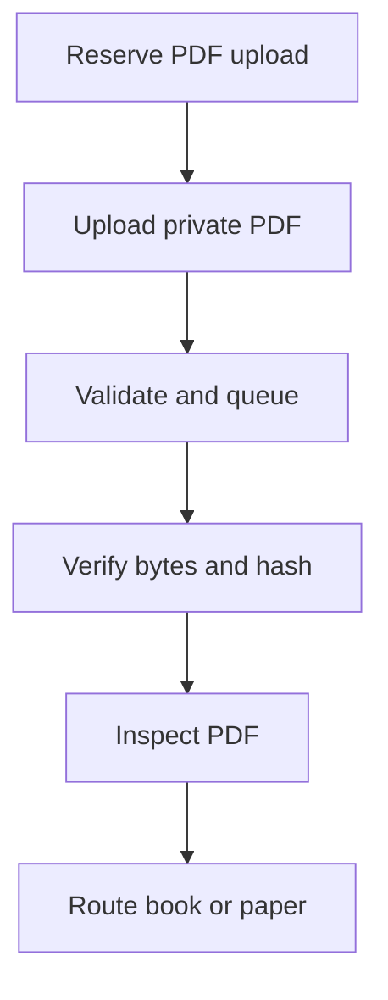
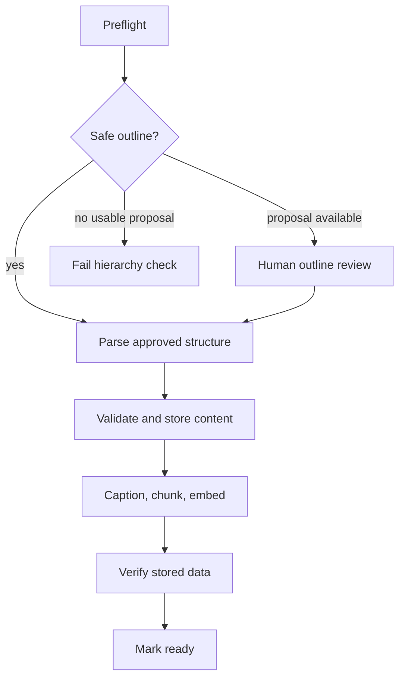
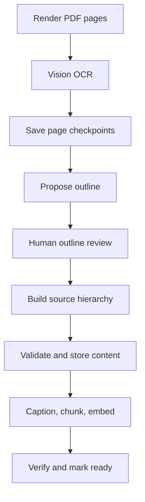
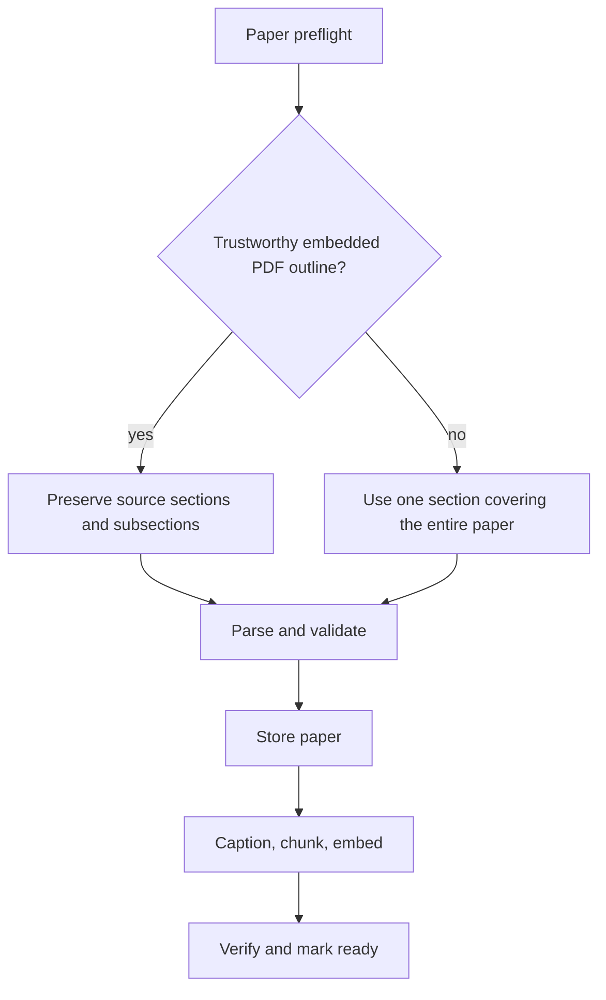
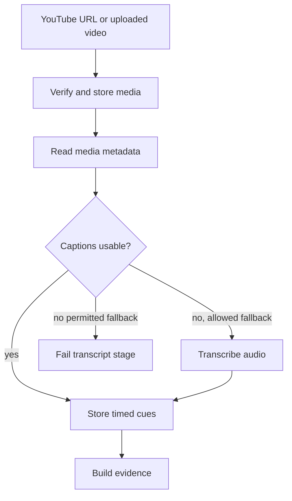
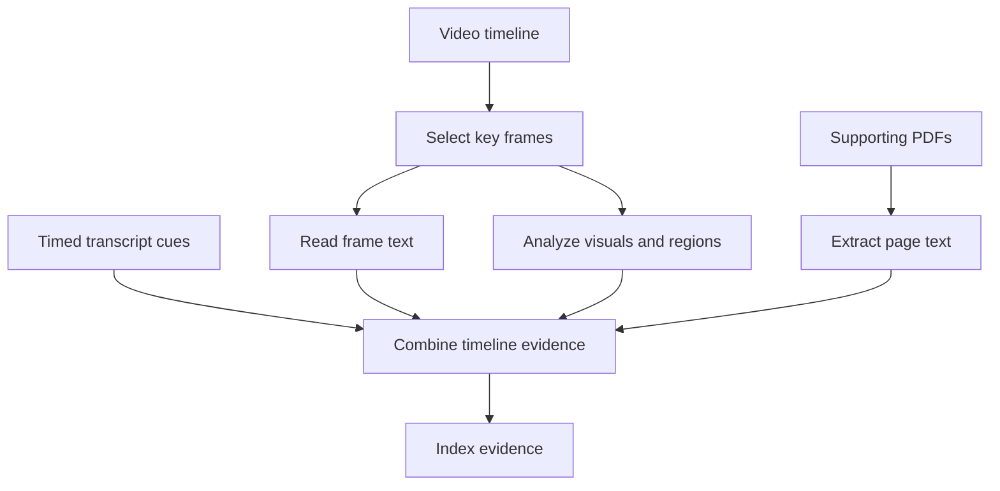
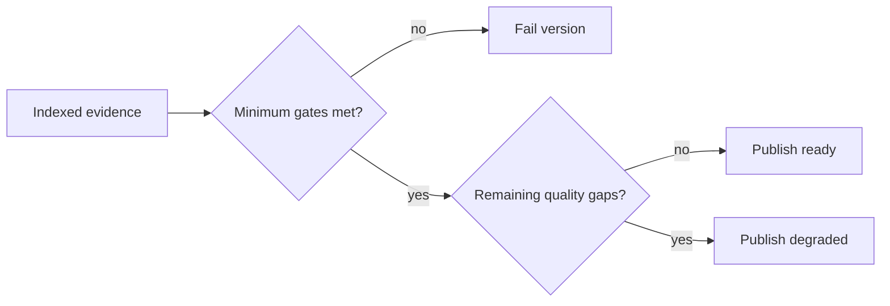

# Ingestion

Ingestion turns source files into canonical content and rebuildable search
artifacts. It uses deterministic Python pipelines, durable jobs, and explicit
publication checks; it is not an autonomous agent loop.

## PDF ingestion

### Shared entry

Reservation uses an idempotency key. A ready copy with the same owner and
source hash is reused. Unreadable, encrypted, empty, and over-limit PDFs fail
before parsing. Text coverage and OCR-overlay detection are separate from
outline quality: a digital PDF can still need outline review.

Code: [upload API](../api/ingestions.py), [preflight](../ingestion/preflight.py).

### Digital books

Unstructured extracts layout; the approved outline assigns page-aware blocks
to sections. An uncertain outline pauses at `needs_toc_review`. Confirmation
resumes the same job after a source-hash check. Figure-caption failure is
recorded without rejecting an otherwise usable book.

Code: [PDF pipeline](../ingestion/pipeline.py), [parser](../parsing/parser.py).

### Scanned, mixed, and OCR-backed books

OCR reads text from page images. This route also handles suspect OCR overlays
or poisoned outlines. Saved page
checkpoints avoid repeating completed transcription. Optional Tesseract
comparison adds warnings; it neither replaces vision text nor blocks ingestion.
Printed contents/page mapping are preferred over detected headings. An unusable
proposal fails. Confirmed sections are built from saved text without rerunning
layout parsing; the source hash and page mapping remain in provenance. Heading
matching ignores leading section numbers. If a reviewed heading cannot be
located on its confirmed page (renamed by the reviewer or missed by OCR), the
section opens at that reviewed page boundary instead of waiting for a later
match.

Code: [OCR stage](../ingestion/ocr_stage.py), [transcription](../ingestion/ocr.py),
[outline review](../ingestion/outlines.py). Model rationale: [decisions](design-decisions.md#model-defaults).

### Papers

Papers use the shared PDF pipeline but do not require invented chapters or
human TOC review. Title selection is metadata → page-one title → filename.
**Scanned papers do not enter the book vision-OCR route** and can fail the
text-quality gate. PDFs attached to videos use a separate page-extraction path.

The outline decision controls how parsed content is grouped:

- **Safe sections** means the PDF's embedded outline/bookmarks passed
  deterministic preflight checks. The exact branch requires
  `report.supported` (the preflight decision is `parse`) and a nonempty
  `report.normalized_toc`. Checks cover readable digital text, valid page
  destinations and hierarchy levels, page order, and heuristics for incomplete
  outlines, suspicious titles, heading/page mismatches, and OCR-generated junk.
  This is confidence in section boundaries, not a judgment of the paper's
  scientific correctness. Visible headings alone do not establish a trusted
  embedded outline.
- **Keep native sections** means preserve the source's accepted section titles,
  nesting, and start pages after harmless encoding/whitespace normalization.
  For example, `Introduction`, `Methods`, and `Results` remain separate study
  scopes, with any subsections nested beneath them. Papers are stored as
  sections/subsections rather than book chapters.
- **Use Full paper scope** means supply the parser with one synthetic outline
  entry, `(1, "Full paper", 1)`, covering page 1 through the final page. This
  groups the paper as one study scope when its embedded outline is missing or
  untrusted. It does not summarize or discard the paper: parsing, page-linked
  content storage, chunking, and indexing still run. Section-specific scopes
  are unavailable through that outline, but page citations and retrieval remain
  available. Normal content-quality checks still apply.

For example, a readable 12-page paper without bookmarks uses one `Full paper`
section spanning all 12 pages instead of guessing boundaries from its visible
headings. The chosen strategy is recorded as `native_sections` or
`whole_document` in ingestion provenance.

Code: [paper routing and `_paper_outline`](../ingestion/pipeline.py),
[preflight](../ingestion/preflight.py),
[outline assessment](../ingestion/outlines.py),
[paper hierarchy storage](../storage/postgres.py).
Verification: [paper outline tests](../tests/test_ingestion_pipeline.py).

## Video ingestion

### Acquisition and transcription

`VIDEO_WORKER_STAGES` can restrict a worker to some pipeline stages. A worker
that handles media metadata also acquires completed primary uploads already
staged for it, while external YouTube downloads stay with a worker configured
for acquisition.

Captions are preferred to paid transcription. Uploaded/acquired VTT candidates
need at least 90% usable coverage; fallback requires permission in request/course
settings and sufficient job budget. Audio supplies speech evidence, while video
frames supply visual evidence.

### Visual and supporting-document evidence

Frame selection suppresses duplicates and caps sampling. Visual analysis adds
observations of diagrams, equations, and demonstrations. Supporting PDFs retain
page identity; a failed resource is recorded individually. Embeddings for text
and image regions depend on course settings; lexical evidence remains available.

### Publication

Hard gates check canonical media, transcript coverage/gaps, transcript evidence,
and successful visual evidence. Sparse visuals, incomplete embeddings, or
missing required resources can produce `degraded` status. Re-ingestion builds a
replacement version; the published version remains available until replacement
succeeds.

Code: [stage pipeline](../video/pipeline.py), [audio](../video/audio.py),
[frames](../video/frames.py), [vision](../video/vision.py),
[resources](../video/resources.py), [evidence](../video/evidence_store.py),
[publication gates](../video/jobs.py).

## Checkpoints and publication contract

| Concern | PDFs | Videos |
|---|---|---|
| Identity | Owner and PDF hash; reviewed outline tied to source | Owner, media hash, ingestion version |
| Resume | OCR pages and committed canonical stages | Stage dependency hashes and output manifests |
| Publish | Restore canonical data; check text, chunk lineage, embeddings | Enforce hard gates; expose remaining quality gaps |

Workers renew leases and reclaim expired attempts. Reuse requires matching
input/configuration dependencies. Derived artifacts are rebuilt from canonical
records, not repaired by editing source text.

Study-time use: [study flows](flows.md). Process and retry configuration:
[operations](operations.md).
