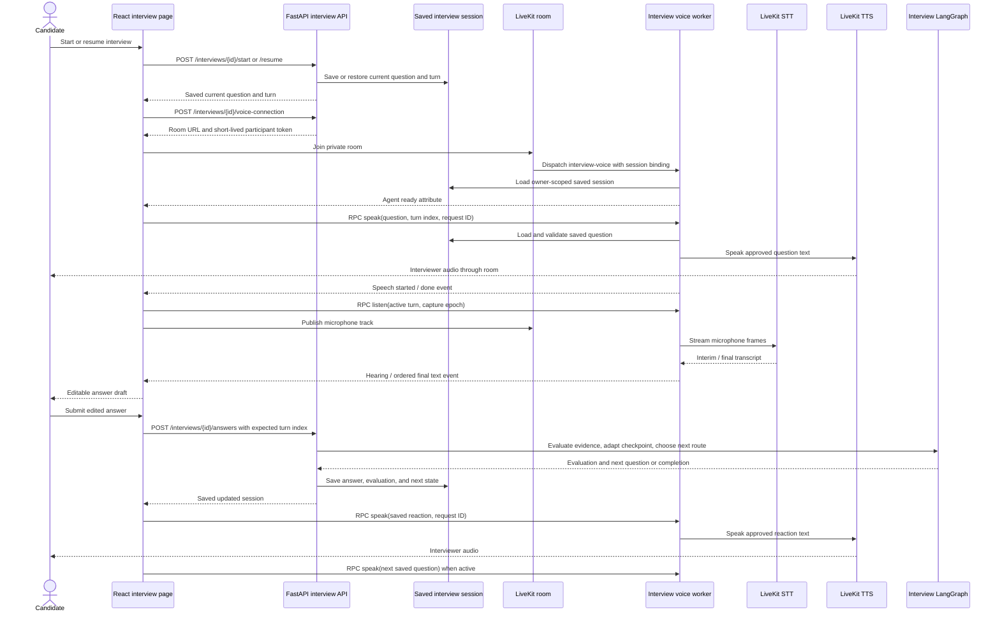
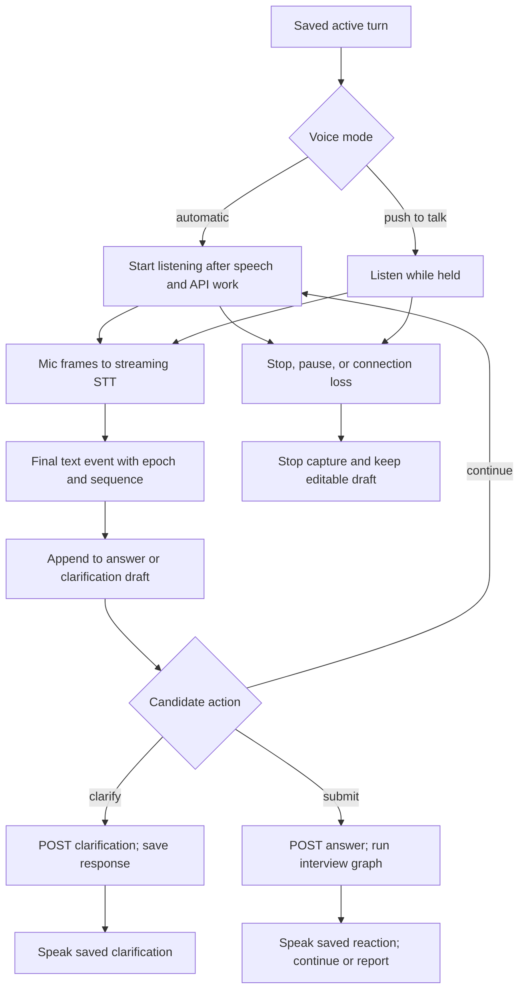

# Adaptive interview voice flow

This describes the **candidate-facing adaptive interview** at
`/interviews/[sessionId]`. LiveKit carries microphone audio, streaming
transcripts, and interviewer speech. The interview API owns questions,
clarifications, answers, evaluation, routing, and the saved report. The voice
worker has no interview LLM and cannot advance a turn by itself. The separate
[ideal chapter interview](flows.md#8-ideal-chapter-interview) is listen-only
playback of an already generated exchange.

## One turn with LiveKit



Setup first creates a session and calls `/start`, which generates and saves the
first grounded question before starting the interview clock. The browser
loads that saved state on navigation or reload. For LiveKit, the authenticated
`voice-connection` endpoint issues a new room and participant token for this
connection. The token can publish microphone audio and data to that room;
the room dispatches the `interview-voice` worker. The worker checks the room
binding and loads the owner-scoped session before marking itself ready. The
frontend waits for that ready signal before sending commands.

The worker speaks only text already saved on the session: the active question,
a saved clarification response, or the latest evaluated reaction. Its
`AgentSession` has TTS and manual turn handling but no independent LLM or
automatic voice agent loop. The browser's final transcript events append to
an **editable draft**. Speech recognition never submits the answer. The
candidate presses Submit; the API checks the expected turn index, invokes the
interview graph, and saves the evaluation and next question together. A lost
HTTP response triggers a session reload before the UI offers a retry, so an
already saved answer is not submitted twice.

## Capture, commands, and recovery



- The RPC method is `interview.voice`: `listen`, `stop_listening`, `flush`,
  `speak`, and `stop_speaking`. `flush` ends the current STT input so a final
  segment can arrive. The worker accepts capture only for the current active
  turn; it validates speech requests against saved session text.
- Automatic listening resumes when the current question is active and the UI
  is neither speaking nor waiting on an API operation. Push to talk begins
  capture on press and flushes on release. The candidate can choose the mic,
  edit the text, stop listening, and replay the interviewer.
- Final transcript events carry a capture epoch and increasing sequence.
  Speech events carry a request ID. The frontend ignores stale events from a
  prior capture or playback and serializes RPC commands. Switching from answer
  dictation to clarification stops the prior capture.
- A clarification is sent to `/clarifications`, then the saved response may be
  spoken. Optional screen checkpoints go through `/screen-checkpoints` and
  become a saved observation for the answer evaluator. Neither media path
  bypasses the interview graph.
- On reconnect, the UI mutes output, stops old capture and speech, and waits
  for an explicit new listening action. If capture or playback fails, the
  draft and visible question remain usable. Text entry is always available.
  Enabling LiveKit does **not** automatically switch a failed LiveKit room to
  the legacy audio-upload transport within that session.

## Model paths and configuration

These are repository defaults and the values in `.env.example`. Runtime
environment variables can override them; voice IDs are configured separately.

| Path | STT | TTS | Notes |
|---|---|---|---|
| LiveKit adaptive interview | `deepgram/nova-3` via LiveKit Inference | `cartesia/sonic-3` via LiveKit Inference | `LIVEKIT_INTERVIEW_STT_MODEL`, `LIVEKIT_INTERVIEW_TTS_MODEL`; `LIVEKIT_INTERVIEW_TTS_VOICE` must be set |
| Non-LiveKit interview | `openai/whisper-large-v3-turbo` via OpenRouter | `mistralai/voxtral-mini-tts-2603` via OpenRouter | Short recorded clips go to `/transcriptions`; interviewer speech uses the authenticated speech endpoints. Browser speech synthesis is a playback fallback if remote TTS fails |
| Listen-only ideal interview | No STT | `cartesia/sonic-3.6` via LiveKit Inference | Separate worker and two configured voices read a persisted flow; it does not evaluate a candidate |

Question generation and answer evaluation use a separate structured model,
defaulting to `openai/gpt-5.6-luna` through OpenRouter. It is not an STT or
TTS model and runs through the interview service rather than the voice worker.

The non-LiveKit path is selected when the frontend build flag
`NEXT_PUBLIC_INTERVIEW_LIVEKIT_ENABLED` is not `true`. It segments microphone
recordings in the browser, uploads each clip to the authenticated
`/transcriptions` endpoint, and appends returned text to the same editable
draft. It requests question, reaction, and clarification audio through the
HTTP speech endpoints. Both transports submit the final text through
`/answers` and use the same saved interview state.

To use LiveKit locally, install the optional dependencies with
`uv sync --extra voice`, configure `INTERVIEW_LIVEKIT_ENABLED=true`,
`LIVEKIT_URL`, `LIVEKIT_API_KEY`, `LIVEKIT_API_SECRET`, and a supported
`LIVEKIT_INTERVIEW_TTS_VOICE`, then run the separate media worker:

```bash
uv run --extra voice python -m interviews.voice_worker dev
```

Build the frontend with `NEXT_PUBLIC_INTERVIEW_LIVEKIT_ENABLED=true` to select
that transport. Keep LiveKit secrets on the API and worker, never in a
`NEXT_PUBLIC_*` variable. The API and voice worker must point at the same
database and LiveKit project. If voice is disabled or unavailable, the
interview itself still works through text submission.

## Ownership, privacy, cost, and observability

Each LiveKit connection gets a distinct room and participant identity. The
browser's participant token has a ten-minute admission TTL; the worker
rejects RPCs from a different participant and scopes session reads to the
bound owner. The API remains the authority for all answer and clarification
writes. Raw interview audio is processed ephemerally; the LiveKit worker uses
`record=False`. Raw screen images are also discarded after analysis. Saved
data includes the edited answer text, evaluation, citations, checkpoint,
screen observation when requested, and aggregate cost.

The media worker logs provider STT/TTS usage metrics and adds estimated voice
cost to the interview session using configurable LiveKit rates. The interview
graph and model calls are traced through the existing LangSmith path when
tracing is configured. Media transport events are separate from those graph
traces; the saved session and provider usage logs are the records to inspect
when diagnosing a voice failure or cost.

## Code map

| Responsibility | Implementation |
|---|---|
| Interview planning, evaluation, and persistence | [`interviews/service.py`](../interviews/service.py), [`interviews/graph.py`](../interviews/graph.py), [`interviews/store.py`](../interviews/store.py) |
| Room admission and saved utterance checks | [`interviews/livekit_voice.py`](../interviews/livekit_voice.py), [`api/interviews.py`](../api/interviews.py) |
| Streaming STT, TTS, commands, and usage | [`interviews/voice_worker.py`](../interviews/voice_worker.py) |
| Frontend LiveKit transport and draft handling | [`frontend/hooks/use-livekit-interview.ts`](../frontend/hooks/use-livekit-interview.ts), [`frontend/app/interviews/[sessionId]/page.tsx`](../frontend/app/interviews/%5BsessionId%5D/page.tsx) |
| Non-LiveKit microphone and speech | [`frontend/hooks/use-interview-voice.ts`](../frontend/hooks/use-interview-voice.ts), [`frontend/hooks/use-interviewer-speech.ts`](../frontend/hooks/use-interviewer-speech.ts), [`narration/synthesis.py`](../narration/synthesis.py) |
| Ideal listen-only voice | [`interviews/ideal_voice_worker.py`](../interviews/ideal_voice_worker.py) |

See [RAG and agent flows](flows.md#7-adaptive-interview) for the interview's
reasoning decisions and [operations](operations.md) for the rest of the local
stack.
