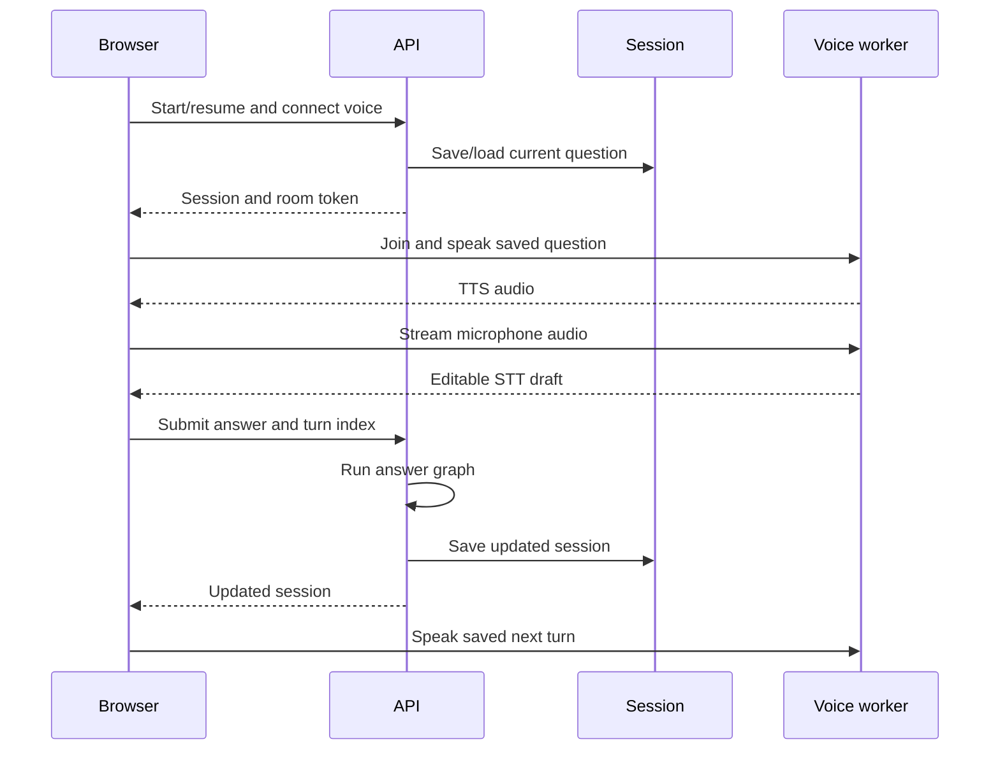

# Interview voice

LiveKit transports audio; the API owns interview reasoning and saved state.
The adaptive voice worker has no interview LLM and cannot advance a turn.
[Ideal interviews](flows.md#ideal-chapter-interview) play saved exchanges without
candidate assessment. Grading and question selection: [interview flows](flows.md#interviews).

## Adaptive LiveKit turn



The first question is saved before the session clock starts. Speech recognition
only fills a draft; candidate submission advances the session. The worker
validates spoken text against saved questions, reactions, and clarifications.
A lost submit response triggers a session reload before retry.

## Transports

| Path | Capture and playback | Configuration |
|---|---|---|
| LiveKit adaptive | Streaming STT; automatic or push-to-talk capture; saved-text TTS | API `INTERVIEW_LIVEKIT_ENABLED`; frontend `NEXT_PUBLIC_INTERVIEW_LIVEKIT_ENABLED` |
| HTTP adaptive | Recorded clips to `/transcriptions`; speech endpoints; browser speech playback fallback | Used when the frontend LiveKit flag is off |
| Ideal interview | Two-voice playback of a persisted flow; no STT | Separate ideal voice worker |
| Read-aloud interruption | Voice draft → anchored side chat; saved-answer speech | `NARRATION_LIVEKIT_ENABLED`; separate narration worker |

All adaptive transports submit final text through `/answers`. LiveKit failure
does not automatically switch an active session to HTTP audio upload. Model
and fallback defaults are centralized in [design decisions](design-decisions.md#model-defaults).

## Commands and recovery

`interview.voice` supports `listen`, `stop_listening`, `flush`, `speak`, and
`stop_speaking`. Flush closes STT input for a final segment. Capture epoch,
sequence, and speech request IDs reject stale events. The frontend serializes
commands and separates answer/clarification drafts.

Pause, disconnection, or media failure stops capture while preserving the
question and editable draft. Reconnect waits for an explicit listening action.
Clarifications and optional screen observations pass through authenticated API
endpoints before entering saved interview state.

## Ownership and observability

Each connection binds a private room/participant to the verified owner/session.
Adaptive participant tokens have a ten-minute admission TTL. RPCs from other
participants are rejected. Raw interview audio and screen images are processed
ephemerally, not persisted. Saved records contain edited text, evaluations,
citations, checkpoints, requested screen observations, and aggregate cost.

LangSmith traces cover graph/model calls when configured. Voice usage logs and
session voice-cost estimates cover the separate STT/TTS transport.

## Local worker

Install `uv sync --extra voice`; configure `LIVEKIT_URL`, `LIVEKIT_API_KEY`,
`LIVEKIT_API_SECRET`, matching enable flags, and supported voice IDs. API and
workers must use the same database and LiveKit project.

```bash
uv run --extra voice python -m interviews.voice_worker dev
```

Secrets remain server-side. Other process commands: [operations](operations.md#processes).

Code: [room admission](../interviews/livekit_voice.py), [API](../api/interviews.py),
[voice worker](../interviews/voice_worker.py), [browser transport](../frontend/hooks/use-livekit-interview.ts),
[HTTP voice](../frontend/hooks/use-interview-voice.ts),
[ideal voice](../interviews/ideal_voice_worker.py), [narration voice](../narration/voice_worker.py).
