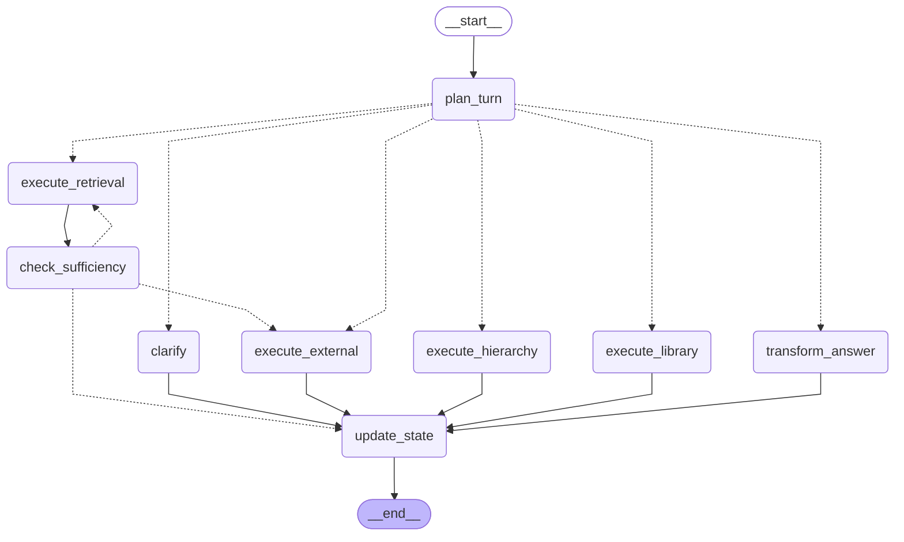
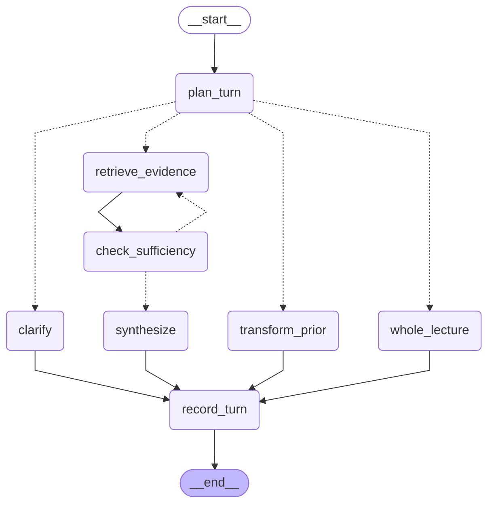
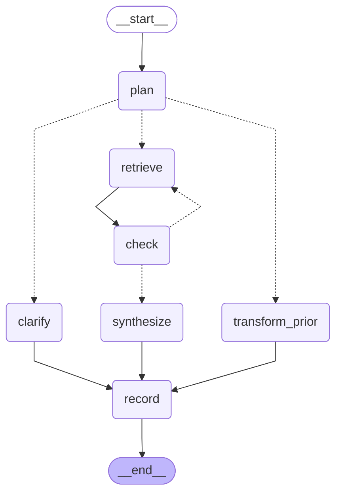
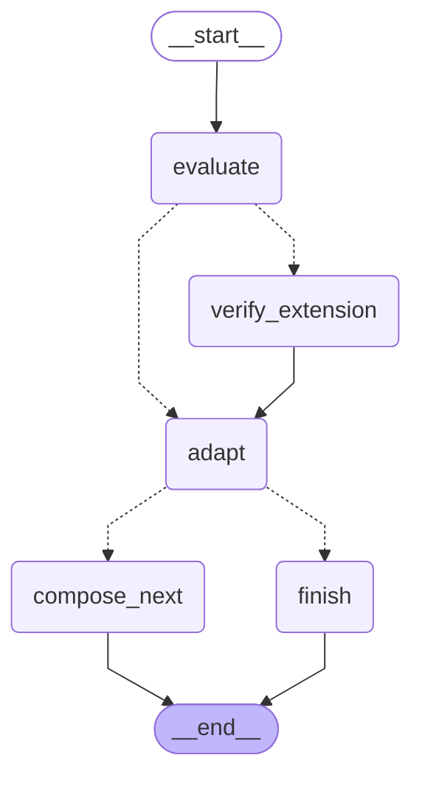
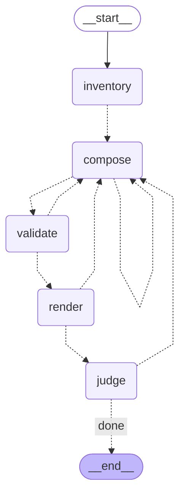

# LangGraph workflows

These diagrams are exported by LangGraph from the same compiled topology used
by the application: `compiled_graph.get_graph().draw_mermaid()`. Node names,
edges, and conditional branches come from executable graph definitions, not a
separately drawn approximation. Dashed arrows are conditional routes; solid
arrows are unconditional. `__start__` and `__end__` are LangGraph boundaries.

The repository has five LangGraph workflows. Reading sessions, side chats, and
card conversations reuse study workflows. PDF/video ingestion, flashcard
generation, summary repair inside a study node, ideal-interview generation,
and speech playback also have control flow, but do not define additional
LangGraph agents. Their product/process diagrams remain in
[study flows](flows.md) and [ingestion](ingestion.md).

## Books and papers: one study turn

Source: [study/graph.py](../study/graph.py), `build_study_graph` / `study_turn_graph`.
Raw export: [study-turn.mmd](graphs/study-turn.mmd).

<!-- BEGIN GENERATED: study-turn -->

<!-- END GENERATED: study-turn -->

`plan_turn` produces a `TurnDecision` using the question and conversation
history. The route selects library listing, complete hierarchy operations
(summary/list/verbatim), retrieval QA, prior-answer transformation, external
QA, or clarification. `update_state` records the turn in conversation state;
API persistence happens outside the graph.

State: `StudyGraphState` carries the question, conversation, decision, result,
and optional grounding rung/widenings. `StudyGraphContext` supplies owner,
database/model dependencies, selected sources, side-chat anchors, and policy.
Only retrieval enters `check_sufficiency`. With a source-first policy it may
retry over a wider library or enter the permitted external route. Each rung
is tried at most once; a source lock or exhausted ladder ends escalation.
Without that policy the sufficiency node proceeds to `update_state`.

## Lectures: one study turn

Source: [video/conversation.py](../video/conversation.py),
`build_video_turn_graph` / `video_turn_graph`.
Raw export: [lecture-turn.mmd](graphs/lecture-turn.mmd).

<!-- BEGIN GENERATED: lecture-turn -->

<!-- END GENERATED: lecture-turn -->

The planner chooses complete-lecture processing, mixed-evidence retrieval,
transformation, or clarification. `whole_lecture` handles complete transcript
scope inside one node. Retrieval checks whether the evidence fits the request,
including whether visual questions have visual evidence. It retries once with
broader retrieval, then synthesizes an answer or abstention. `record_turn`
updates the conversation state returned to the caller.

State: `VideoGraphState` carries the decision, retrieval, attempt count,
sufficiency verdict, result, and conversation. `VideoTurnContext` supplies the
owner, database connection, lecture identity, models, and optional anchors.

## Courses: one study turn

Source: [video/course_conversation.py](../video/course_conversation.py),
`build_graph` / `course_turn_graph`.
Raw export: [course-turn.mmd](graphs/course-turn.mmd).

<!-- BEGIN GENERATED: course-turn -->

<!-- END GENERATED: course-turn -->

The planner routes to retrieval, transformation, or clarification. Retrieval
searches the selected published lectures with per-lecture caps. `check` permits
one broader retry, then `synthesize` answers or abstains and `record` updates
the conversation state. There is no complete-course transcript node in this
graph.

State: `CourseGraphState` carries question/history, decision, retrieval,
attempts, sufficiency, and result. `CourseTurnContext` carries owner/database
dependencies and the course's selected lectures.

## Adaptive interviews: one submitted answer

Source: [interviews/graph.py](../interviews/graph.py),
`build_answer_graph` / `answer_graph`.
Raw export: [interview-answer.mmd](graphs/interview-answer.mmd).

<!-- BEGIN GENERATED: interview-answer -->

<!-- END GENERATED: interview-answer -->

`evaluate` grades against the current rubric. If the evaluation flags an
external extension for verification, `verify_extension` checks it before
`adapt` updates the coverage/probe checkpoint. The next route either finishes
or composes the next question. Duration, topic completion, and system-design
progress inform that choice.

State: `AnswerGraphState` carries the session, inventory, current turn,
candidate answer, evaluation, checkpoint, and next question/finish result.
`AnswerGraphContext` supplies evaluation and question-model dependencies.
This graph processes one answer; it ends after producing the next question.
The next candidate submission starts another graph run, so the overall
interview's user interaction loop is outside this diagram.

## Revision sheets: one artifact generation

Topology: [revision_sheets/graph.py](../revision_sheets/graph.py),
`build_revision_graph`. Runtime nodes:
[revision_sheets/generate.py](../revision_sheets/generate.py), `generate`.
Raw export: [revision-sheet.mmd](graphs/revision-sheet.mmd).

<!-- BEGIN GENERATED: revision-sheet -->

<!-- END GENERATED: revision-sheet -->

`inventory` inspects source figures and inventories the complete source.
`compose` writes the sheet; `validate` checks content/citations; `render` checks
page fit; `judge` independently reviews quality. Schema/content errors retry
composition within the shared content-repair budget; rendering permits one
fit repair; judging permits two quality repairs. Exceptions stop the job for
unsafe content, unavailable evidence, or unrecoverable layout. A sheet that
reaches the quality-repair limit can finish with recorded outstanding findings.
Exceptions are not graph edges. Publishing and job persistence happen in the
worker after successful graph completion.

State: `State` stores the draft, inventory, PDF/HTML, feedback, review history,
and repair counters. Generation binds source/model/progress closures into the
shared builder. Exporting binds functions that refuse execution, because
diagram generation needs topology only and must not run model calls or render
private material. Both use the same state schema, nodes, and branch maps.

## Regenerate and verify

```bash
uv run python -m scripts.export_langgraph_diagrams
uv run python -m scripts.export_langgraph_diagrams --check
```

The exporter writes `docs/graphs/*.mmd` and replaces only the marked diagram
blocks in this guide. It uses installed LangGraph/LangChain libraries, with
no graph invocation, database connection, model call, or remote image-rendering
service. `--check` exits nonzero for missing/stale artifacts and never writes.
These checks run in CI. Do not hand-edit generated blocks or raw exports.
When adding another LangGraph workflow, register it in
[the exporter](../scripts/export_langgraph_diagrams.py), add its documented
state/routing behavior and diagram markers here, then regenerate.

Conditional routers declare their destinations through `Literal` return
annotations or explicit path maps so LangGraph can include their branches in
its visualization. These diagrams show possible routes, not the path of a
particular execution; LangSmith traces show the path actually taken.
