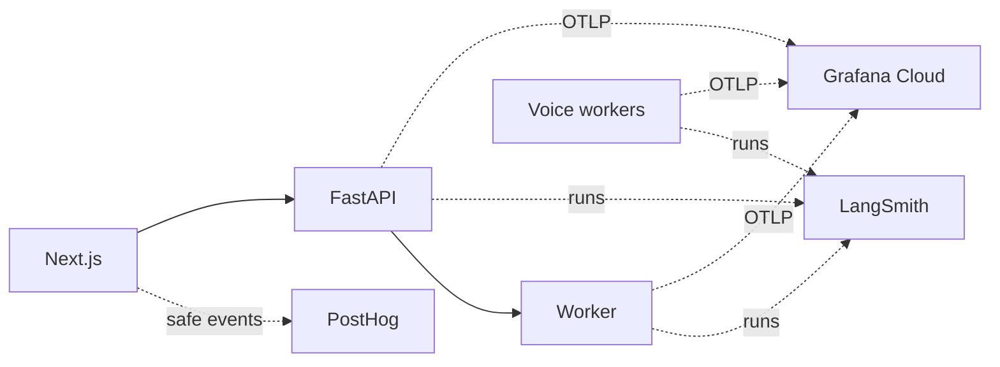

# Observability

Three tools answer three different questions. Each is optional and disabled
until configured; a telemetry failure never changes an application result.

| Tool | Question it answers | Signals |
|---|---|---|
| [LangSmith](#langsmith-ai-traces) | What did the model see, decide and cost? | Graph nodes, prompts, retrieved evidence, model calls, tokens, cost |
| [Grafana Cloud](#grafana-cloud-operational-health) | Is the system healthy and where is time spent? | Structured logs (Loki), operational traces (Tempo), operation and process metrics |
| [PostHog](#posthog-product-usage) | How is the interface used? | Page views, control activations, API outcomes, streamed-answer outcomes |



Shared boundaries live in [observability.py](../observability.py) (LangSmith
runs for HTTP, Python workflows and direct provider calls) and
[operations_telemetry.py](../operations_telemetry.py) (OpenTelemetry export and
JSON logging). The browser side is
[analytics.ts](../frontend/lib/analytics.ts) and the root
[analytics observer](../frontend/components/analytics-observer.tsx).

## LangSmith: AI traces

Tracing is repository-wide, not limited to the flows with deep quality
evaluation. Set these on the API, worker and any enabled voice worker:

```dotenv
LANGSMITH_TRACING=true
LANGSMITH_API_KEY=your-key
LANGSMITH_PROJECT=agentic-study-partner-local
```

Use a distinct project per environment. `LANGSMITH_TRACING=false` disables all
boundaries and provider captures. Routine notification polling and the
reminder reconciler go to `<LANGSMITH_PROJECT>-operations` (override with
`LANGSMITH_OPERATIONS_PROJECT`) so idle checks do not bury study traces.
Evaluation runs use their own `study-partner-evals-<run>` projects.

### Trace organization

- **HTTP requests** are roots named by route template, such as
  `http.POST /api/conversations/{conversation_id}/turns`. The root encloses
  loading, routing, retrieval, LangGraph nodes, model calls and persistence;
  for SSE it ends after the final event, not at the HTTP headers. Responses
  expose `X-LangSmith-Trace-Id`.
- **Queued jobs** get a separate root per worker attempt, joined to the
  enqueue request by `job_id`. Queue wait is not counted as execution; no span
  is held open during human outline review.
- **Voice sessions** create roots per command, correlated by session,
  conversation or ideal-flow ID rather than one span for the room's lifetime.
- **Names** are real Python operations, such as
  `video.pipeline._run_transcript`. Filter by `flow`, `thread_id`,
  `conversation_id`, `session_id`, `job_id`, `attempt_count`, `stage`, source
  IDs or `flow:*` tags.

To inspect a request, open the project, choose **Traces**, and open the HTTP
root by its response ID or a metadata filter; expand children for model calls,
tools and graph stages.

### Coverage

| Path | Inspectable boundaries |
|---|---|
| All HTTP routes | Request lifetime, route, status, available entity IDs |
| Book/paper chat and side chats | Load/execute/persist, routing, hierarchy or retrieval, graph nodes, model calls, streaming |
| Summaries | Scope loading, draft, validation, repair, model calls |
| Video and course study | Graph, evidence retrieval, complete lecture summarization, persistence |
| Interviews and ideal interviews | Source inventory, create/start/answer, hints, clarification, report, adaptive graph; each generated exchange |
| Revision sheets | Worker attempt, source loading, figure reading, graph stages, render/quality repair, publish, follow-up QA |
| Cards | Enqueue, worker, inventory, extraction, generation batches, validation, reviews, card conversations |
| PDF ingestion | Acquisition, validation, OCR/outline proposal, parsing, canonical persistence, verification |
| Video/course ingestion | Media, transcript, resources, frames, OCR, visual analysis, indexing, embeddings, quality gates, publish |
| Retrieval | BM25, hybrid selection, vector queries, rerank, external search |
| Direct OpenRouter calls | One `llm`, `embedding` or `tool` child per physical request (OCR, captions, vision, embeddings, rerank, STT, TTS) |
| Narration, dictation, LiveKit voice | Figure descriptions, audio cache decisions, synthesis/transcription, session commands, SDK usage events |
| Reminders and CLIs | Reconciliation, core study/ingestion/indexing commands, evaluation entrypoints |

Boundaries wrap meaningful operations, not every utility function or SQL
statement. Threads used for SSE and concurrent OCR inherit the submitting
context; async tasks keep Python's context propagation.

### Usage, cost and capture

Raw chat calls use `run_type="llm"` with model/provider metadata and
`usage_metadata`. Provider cost sits on the physical call; never add a root's
aggregate to its children. Retries are separate attempts. Missing receipts
stay `unreported`; configured speech rates are tagged as estimates. Cache hits
add no provider cost.

Captures omit dependency objects and authorization headers, redact credential
fields and signed URL queries, replace inline media and bound text size.
Prompts and bounded source evidence are still trace data, so set project access
and retention accordingly. Incoming LangSmith trace headers are ignored at the
public HTTP boundary.

## Grafana Cloud: operational health

Python exports logs, traces and metrics directly over OTLP/HTTP; there is no
collector container. Grafana documents
[direct SDK export](https://grafana.com/docs/grafana-cloud/send-data/otlp/send-data-otlp/)
for low-traffic setups. SDK queues are bounded and best-effort, so an outage
can drop telemetry. Add Alloy or a collector only if durable buffering or
central sampling becomes necessary. JSON logs also work locally without an
account.

### Setup

1. Create a Grafana Cloud **Free** stack. In its OpenTelemetry tile, generate a
   write token scoped to metrics, logs and traces.
2. Set these on each API, worker and voice service (Compose passes `.env` to
   backend services; the combined Railway service passes its environment to
   both child processes):

   ```dotenv
   OTEL_ENABLED=true
   OTEL_EXPORTER_OTLP_ENDPOINT=<generated base endpoint, including /otlp>
   OTEL_EXPORTER_OTLP_HEADERS=<generated encoded Authorization header>
   OTEL_EXPORTER_OTLP_PROTOCOL=http/protobuf
   APP_ENV=local
   ```

   Do not append `/v1/traces`; exporters add signal paths. Leave
   `OTEL_SERVICE_NAME` unset so API and worker get distinct names. Never put
   the token in browser variables or commits.
3. Restart the processes. Import
   [the dashboard template](../ops/observability/grafana-dashboard.json) and
   select your Prometheus data source. Its Environment variable filters every
   panel by `deployment_environment_name`.

Rotate the write token in backend secrets and restart exporters before it
expires. Management logins (for example `gcx`) are separate from this
write-only application token.

### What is measured

| Signal | Meaning and limits |
|---|---|
| Access logs | Route template, status, correlation IDs; no query strings, authorization or bodies. Emitted after streaming finishes |
| Operational traces | HTTP, Python workflow, provider, queue-attempt and voice boundaries. Responses expose `X-Trace-Id` |
| `study.operation.count` | Completed root requests/jobs by flow and outcome, including retries |
| `study.operation.duration` | Root wall-clock seconds; streaming includes the full response |
| `process.cpu.time` | Cumulative user + system CPU seconds; rate × 100 is percent of one core |
| `process.memory.usage` | Current process RSS per API, worker or voice process; not container memory |

The dashboard shows throughput, p95 latency, failed-attempt fraction, CPU and
memory. Metric labels never include job/session/book IDs, raw paths or
prompts. Exception records carry type and status, not messages or locals. Not
instrumented: individual SQL statements, external SDK internals, host metrics,
browser spans and the Next.js server. AI tokens and cost stay in LangSmith.

### Querying

Use **Explore → Loki** for logs and **Explore → Tempo** with a response's
`X-Trace-Id` for the span tree. Logs carry `trace_id`, `span_id` and, when
LangSmith is enabled, `langsmith_trace_id`.

```logql
{deployment_environment_name="production",service_name="study-partner-api"} | json | trace_id="<X-Trace-Id>"
```

A typical investigation: latency regression → slow operational stage in Tempo
→ its retrieval/model trace in LangSmith. For retries or errors, filter by
`job_id` and read the structured failure code.

## PostHog: product usage

Create a free PostHog Cloud project and configure the web build with its
public project key:

```dotenv
NEXT_PUBLIC_ANALYTICS_ENABLED=true
NEXT_PUBLIC_POSTHOG_KEY=<public project key>
NEXT_PUBLIC_POSTHOG_HOST=https://us.i.posthog.com
# EU projects use https://eu.i.posthog.com
```

These are build-time variables: restart Next dev (`frontend/.env.local`),
rebuild the Compose web image, or redeploy the web service after changing
them. [The dashboard definition](../ops/observability/posthog-dashboard.json)
contains page visitors, retention, API outcomes, streamed study outcomes and a
chat funnel.

| Event | Meaning |
|---|---|
| `$pageview` | Route visit, with dynamic IDs replaced by `:id` |
| `ui_action` | Button, link, tab or menu activation with a static action/type label |
| `signed_in`, `signed_out` | Auth lifecycle; identity resets on sign-out |
| `api_action_started`, `api_action_response`, `api_action_failed` | Mutating API request start, status/time to headers with trace IDs, or network failure |
| `study_answer_completed`, `study_answer_failed` | Final streamed answer or failed/cancelled stream for chat, side chat, video and course study |

The root observer covers every page without reading visible text or form
values; `trackedFetch` records mutating API calls while preserving the
original response and errors. GET polling and image requests are excluded.
An HTTP 200/202 means acceptance, not finished background generation; use
backend traces for queued summaries, cards and sheets. Slider, media-time and
individual source clicks are not semantic events yet.

Privacy: autocapture and session recording are off. A `before_send` allowlist
drops prompts, answers, source names, URLs and queries, form values, email,
tokens, referrer/title fields and profile enrichment; geolocation is disabled.
Collection respects Do Not Track, so counts are not an audit source.

## Following one request across tools

Authenticated API work carries `user_id`, the verified Supabase auth `sub`
UUID, on Grafana logs and spans, LangSmith run metadata and as the PostHog
`distinct_id`. Headers, query strings and request bodies cannot set it;
anonymous, invalid-auth and system work has none. Workers take it from the
job's persisted `owner_id`; voice workers from validated session bindings.
Email never enters telemetry, and `user_id` is never a metric or Loki stream
label.

| Tool | Filter |
|---|---|
| Loki | `{deployment_environment_name="production"} \| json \| user_id="<uuid>"` |
| Tempo | `{ span.user_id = "<uuid>" }` |
| LangSmith | **Filter → Metadata → user_id** |
| PostHog | **People** → the person whose ID is the UUID → activity |

Per request, `X-Trace-Id` (Tempo) and `X-LangSmith-Trace-Id` (LangSmith) are
exposed through CORS and recorded on `api_action_response` events.

## Verification

No-network checks cover SDK/LangGraph parentage, threaded streaming, HTTP/SSE
errors, provider retry receipts, disabled operation, redaction, OTLP wire
format and exporter failure isolation. A coverage check rejects unwrapped raw
inference calls in OpenRouter clients.

```bash
uv run python -m pytest tests/test_operations_telemetry.py tests/test_observability.py \
  tests/test_docker_image_contents.py tests/test_environment_contracts.py tests/test_serve.py -q
npm --prefix frontend test
```

Hosted LangSmith delivery, with synthetic inputs and no paid inference:

```bash
uv run python -m scripts.check_langsmith_tracing
```

This writes five nested spans to `${LANGSMITH_PROJECT}-tracing-smoke`, reads
them back and prints the link. For Grafana, request `/openapi.json` (200) and
`/api/books` without auth (401), wait two 60-second export intervals, and find
both `X-Trace-Id` values in Tempo and Loki. If data is missing, check process
restart, exporter errors, endpoint/authorization, service filter, time range
and, for LangSmith, the account's monthly trace quota.

SDK references: [manual model traces](https://docs.langchain.com/langsmith/log-llm-trace),
[thread metadata](https://docs.langchain.com/langsmith/threads),
[cost tracking](https://docs.langchain.com/langsmith/cost-tracking).
